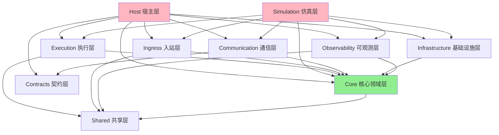
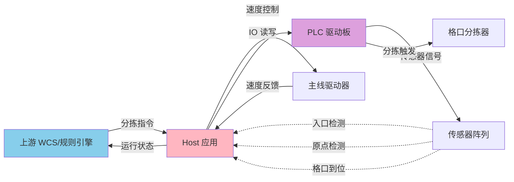
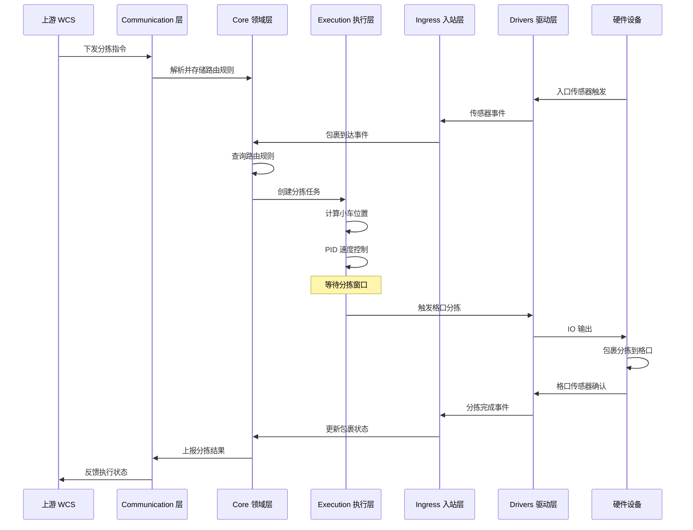
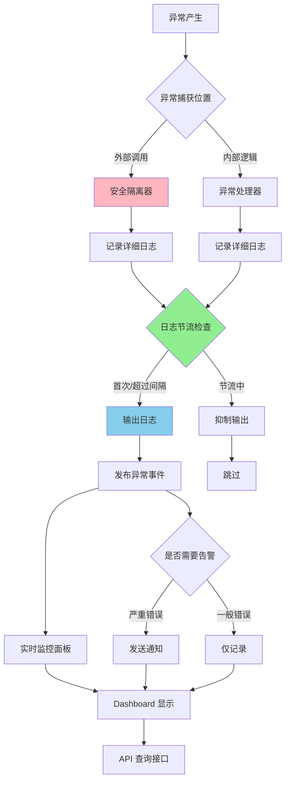

# ZakYip.NarrowBeltDiverterSorter

针对直线窄带分拣系统的专用项目 (Dedicated project for narrow belt diverter sorting system)

## 目录 (Table of Contents)

- [系统概览](#系统概览-system-overview)
- [项目结构](#项目结构-project-structure)
- [系统架构](#系统架构-system-architecture)
- [运行流程](#运行流程-execution-flow)
- [技术栈](#技术栈-technology-stack)
- [开发指南](#开发指南-development-guide)
- [文档导航](#文档导航-documentation-navigation)
- [贡献指南](#贡献指南-contributing)

## 系统概览 (System Overview)

本项目是一个高性能、可扩展的窄带分拣系统控制软件，采用分层架构设计，支持实时包裹跟踪、动态路由和多种硬件驱动。

### 核心特性

- ✅ 分层架构设计，各层职责清晰
- ✅ 支持仿真模式和真实硬件模式
- ✅ 实时可观测性（日志、事件总线、实时监控）
- ✅ 高可靠性（异常隔离、故障管理、安全控制）
- ✅ 灵活配置（LiteDB 持久化配置、API 动态更新）
- ✅ 完整测试覆盖（单元测试、集成测试、E2E 测试）

## 项目结构 (Project Structure)

本解决方案采用分层架构设计，各层职责清晰：

### 核心层 (Core Layers)

- **ZakYip.NarrowBeltDiverterSorter.Core**  
  领域模型与契约层，定义核心业务实体、接口和数据契约

- **ZakYip.NarrowBeltDiverterSorter.Execution**  
  执行逻辑层，包含主驱控制、PID 算法、小车追踪等核心执行逻辑

- **ZakYip.NarrowBeltDiverterSorter.Ingress**  
  入站处理层，负责 IO 监听、传感器数据解读和事件转发

- **ZakYip.NarrowBeltDiverterSorter.Drivers**  
  硬件驱动层，封装具体硬件设备的驱动接口

- **ZakYip.NarrowBeltDiverterSorter.Communication**  
  通信协议层，封装与上游系统/WCS 和驱动板的通信协议

- **ZakYip.NarrowBeltDiverterSorter.Observability**  
  可观测性层，提供日志、指标和追踪功能

- **ZakYip.NarrowBeltDiverterSorter.Host**  
  运行宿主层，支持 Windows 服务和控制台模式的应用程序入口

- **ZakYip.NarrowBeltDiverterSorter.Simulation**  
  仿真程序层，使用 Fake 实现替代真实硬件，模拟完整的分拣流程

### 测试项目 (Test Projects)

- **ZakYip.NarrowBeltDiverterSorter.Core.Tests**  
  Core 层单元测试

- **ZakYip.NarrowBeltDiverterSorter.Execution.Tests**  
  Execution 层单元测试

- **ZakYip.NarrowBeltDiverterSorter.Ingress.Tests**  
  Ingress 层单元测试

- **ZakYip.NarrowBeltDiverterSorter.Observability.Tests**  
  Observability 层单元测试

- **ZakYip.NarrowBeltDiverterSorter.E2ETests**  
  端到端集成测试

## 技术栈 (Technology Stack)

- .NET 8.0
- C# (with nullable reference types enabled)
- xUnit (for testing)

## 开发指南 (Development Guide)

### 本地一键验证 (Local One-Click Verification)

为确保代码质量，项目提供了一键构建和测试脚本，执行完整的验证流程：

**Windows (PowerShell)：**

```powershell
.\build.ps1
```

**Linux / macOS (Bash)：**

```bash
./build.sh
```

脚本会自动执行以下步骤：
1. 还原 NuGet 包
2. 编译解决方案（Release 模式，警告视为错误）
3. 运行所有测试（包括单元测试和 E2E 测试）

### 构建项目 (Build)

```bash
dotnet build
```

### 运行测试 (Run Tests)

```bash
dotnet test
```

#### 执行特定类别的测试

项目包含多种测试类别，可以通过过滤器选择性执行：

```bash
# 执行所有测试（包括单元测试、集成测试和仿真测试）
dotnet test

# 仅执行仿真测试（验证首车/格口/包裹绑定逻辑）
dotnet test --filter "TestCategory=Simulation"

# 仅执行小车绑定相关测试
dotnet test --filter "TestCategory=CartBinding"

# 执行仿真测试项目
dotnet test Tests/ZakYip.NarrowBeltDiverterSorter.Simulator.Tests
```

**仿真测试说明**：
- 仿真测试位于 `ZakYip.NarrowBeltDiverterSorter.Simulator.Tests` 项目
- 验证首车原点基准下的格口小车号计算、包裹绑定一致性、配置热更新和异常处理
- 覆盖场景：基础正确性、连续移动、热更新、异常场景
- 详细文档：[docs/NarrowBelt/CartNumberingAndChutes.md](docs/NarrowBelt/CartNumberingAndChutes.md#八仿真测试与回归验证)


### 运行宿主程序 (Run Host)

```bash
cd ZakYip.NarrowBeltDiverterSorter.Host
dotnet run
```

#### 启动模式 (Startup Modes)

宿主程序支持多种启动模式，便于逐步调试和验证系统：

**启动命令示例：**

```bash
# 正常模式（默认）- 启动所有服务
dotnet run --mode normal

# 主线调试模式 - 只启动主线控制和原点监控
dotnet run --mode bringup-mainline

# 入口调试模式 - 增加入口传感器和包裹装载
dotnet run --mode bringup-infeed

# 吐件调试模式 - 增加分拣执行和格口IO
dotnet run --mode bringup-chutes
```

详细说明请参考：[docs/BringUpGuide.md](docs/BringUpGuide.md)

#### 主线驱动配置 (Main Line Drive Configuration)

宿主程序支持通过配置文件切换主线驱动实现，无需修改代码：

**配置示例（appsettings.json）：**

```json
{
  "Sorter": {
    "MainLine": {
      "Implementation": "Simulation"  // 可选值: "Simulation" 或 "RemaLm1000H"
    }
  }
}
```

**可选实现类型：**

- **Simulation**: 仿真主线驱动
  - 用于开发和测试环境
  - 不依赖真实硬件
  - 模拟速度渐变和状态变化

- **RemaLm1000H**: 雷马 LM1000H 变频驱动器
  - 用于生产环境
  - 内置 PID 速度控制
  - 通过 Modbus RTU 协议通讯

**RemaLm1000H 配置参数：**

当使用 `RemaLm1000H` 实现时，需要配置以下参数（在 appsettings.json 的 `RemaLm1000H` 节中）：

```json
{
  "RemaLm1000H": {
    "LoopPeriod": "00:00:00.060",        // 控制循环周期（60ms）
    "LimitHz": 25.0,                      // 频率上限（Hz）
    "MinMmps": 0.0,                       // 最小速度（mm/s）
    "MaxMmps": 3000.0,                    // 最大速度（mm/s）
    "StableDeadbandMmps": 20.0,          // 稳定死区（mm/s）
    "StableHold": "00:00:01",            // 稳定保持时间
    "TorqueMax": 1000,                    // 最大扭矩（0-1000 = 0-100%额定电流）
    "Pid": {                              // PID 参数
      "Kp": 0.28,
      "Ki": 0.028,
      "Kd": 0.005
    }
  }
}
```

完整配置参数说明请参考 `RemaLm1000HOptions.cs` 中的注释。

**Rema 实机 Bring-up 调试：**

使用 Rema LM1000H 变频驱动器进行实机调试时，可以使用 Bring-up 模式获取详细的诊断信息：

```bash
# 启动主线调试模式
cd ZakYip.NarrowBeltDiverterSorter.Host
dotnet run --mode bringup-mainline
```

在 Bring-up 模式下，系统会每秒输出以下诊断信息：
- 串口配置和站号
- 最近一次成功下发的目标速度
- C0.26 反馈频率和换算后的线速度

这些信息可用于排查串口通讯问题、验证命令下发、检查编码器反馈等。

**详细的 Rema 实机调试指南请参考：[docs/RemaLm1000HBringUpGuide.md](docs/RemaLm1000HBringUpGuide.md)**

**启动日志：**

系统启动时会输出当前使用的主线驱动实现：

```
主线驱动实现: 仿真主线
```

或

```
主线驱动实现: Rema LM1000H
```

### 运行仿真程序 (Run Simulation)

仿真程序提供了一个完整的模拟环境，使用 Fake 实现替代真实硬件：

```bash
cd ZakYip.NarrowBeltDiverterSorter.Simulation
dotnet run
```

仿真功能包括：
- 模拟主线驱动和反馈
- 模拟小车运动和原点传感器
- 模拟入口传感器和包裹生成
- 模拟格口发信器和分拣过程
- 中文控制台日志输出

详细设计文档请参阅 [docs/NarrowBeltDesign.md](docs/NarrowBeltDesign.md)

## 文档导航 (Documentation Navigation)

### 架构设计文档

- **[Layering.md](docs/architecture/Layering.md)** - 分层架构设计原则与规范
- **[Dependencies.md](docs/architecture/Dependencies.md)** - 项目依赖关系与管理
- **[Contracts.md](docs/architecture/Contracts.md)** - 契约层设计与接口定义
- **[ARCHITECTURE_BASELINE_SUMMARY.md](docs/architecture/ARCHITECTURE_BASELINE_SUMMARY.md)** - 架构基线总结
- **[DOMAIN_PURIFICATION_SUMMARY_CN.md](docs/architecture/DOMAIN_PURIFICATION_SUMMARY_CN.md)** - 领域层净化总结
- **[PORTS_ADAPTERS_REFACTORING_SUMMARY.md](docs/architecture/PORTS_ADAPTERS_REFACTORING_SUMMARY.md)** - 端口适配器重构总结
- **[SORTING_SYSTEM.md](docs/architecture/SORTING_SYSTEM.md)** - 分拣系统架构文档

### 执行与运维文档

- **[BringUpGuide.md](docs/BringUpGuide.md)** - Bring-up 模式指南，包含逐步调试步骤
- **[RemaLm1000HBringUpGuide.md](docs/RemaLm1000HBringUpGuide.md)** - Rema LM1000H 主线实机 Bring-up 详细指南
- **[NarrowBeltDesign.md](docs/NarrowBeltDesign.md)** - 窄带分拣机设计文档
  - 与 WheelDiverterSorter 的异同对比
  - 双 IO 数小车算法说明
  - 入口 IO 到落车的时间-位置换算
  - 主驱稳速与格口发信器窗口控制
  - 强排口清空策略

### 可观测性文档

- **[SAFETY_CONTROL.md](docs/SAFETY_CONTROL.md)** - 安全控制设计
- **[CHUTE_IO_SIMULATION.md](docs/CHUTE_IO_SIMULATION.md)** - 格口 IO 仿真
- **[ChuteIoArchitecture.md](docs/ChuteIoArchitecture.md)** - 格口 IO 架构
- **[SIGNALR_REALTIME_MONITORING.md](docs/SIGNALR_REALTIME_MONITORING.md)** - SignalR 实时监控
- **[REALTIME_MONITORING_PR_SUMMARY.md](docs/REALTIME_MONITORING_PR_SUMMARY.md)** - 实时监控 PR 总结
- **[RECORDING_REPLAY_README.md](docs/observability/RECORDING_REPLAY_README.md)** - 录制回放功能说明
- **[RECORDING_REPLAY_SIMULATION_SETUP.md](docs/observability/RECORDING_REPLAY_SIMULATION_SETUP.md)** - 录制回放仿真设置

### 配置与集成文档

- **[LiteDB_Configuration_Refactoring.md](docs/LiteDB_Configuration_Refactoring.md)** - LiteDB 配置重构说明
- **[UPSTREAM_ROUTING_CONFIG_API.md](docs/UPSTREAM_ROUTING_CONFIG_API.md)** - 上游路由配置 API

### 实施总结文档

存放在 `docs/implementation-summaries/` 目录下，包含各个功能模块的实施总结：

- **[IMPLEMENTATION_SUMMARY.md](docs/implementation-summaries/IMPLEMENTATION_SUMMARY.md)** - 总体实施总结
- **[PR1_RUNTIME_COMMUNICATION_REFACTOR_SUMMARY.md](docs/implementation-summaries/PR1_RUNTIME_COMMUNICATION_REFACTOR_SUMMARY.md)** - PR1 运行时通信重构
- **[PR2_IMPLEMENTATION_GUIDE.md](docs/implementation-summaries/PR2_IMPLEMENTATION_GUIDE.md)** - PR2 实施指南
- **[PR2_WORK_SUMMARY.md](docs/implementation-summaries/PR2_WORK_SUMMARY.md)** - PR2 工作总结
- **[PR4_IMPLEMENTATION_SUMMARY.md](docs/implementation-summaries/PR4_IMPLEMENTATION_SUMMARY.md)** - PR4 实施总结
- **[FAULT_MANAGEMENT_IMPLEMENTATION_SUMMARY.md](docs/implementation-summaries/FAULT_MANAGEMENT_IMPLEMENTATION_SUMMARY.md)** - 故障管理实施
- **[FEEDING_BACKPRESSURE_IMPLEMENTATION.md](docs/implementation-summaries/FEEDING_BACKPRESSURE_IMPLEMENTATION.md)** - 供料背压实施
- **[RECORDING_REPLAY_IMPLEMENTATION_SUMMARY.md](docs/implementation-summaries/RECORDING_REPLAY_IMPLEMENTATION_SUMMARY.md)** - 录制回放实施
- **[SHARED_LAYER_IMPLEMENTATION_SUMMARY.md](docs/implementation-summaries/SHARED_LAYER_IMPLEMENTATION_SUMMARY.md)** - 共享层实施
- **[TECHNICAL_DEBT_CLEANUP_SUMMARY.md](docs/implementation-summaries/TECHNICAL_DEBT_CLEANUP_SUMMARY.md)** - 技术债清理
- **[UPSTREAM_RULE_ENGINE_PORT_IMPLEMENTATION.md](docs/implementation-summaries/UPSTREAM_RULE_ENGINE_PORT_IMPLEMENTATION.md)** - 上游规则引擎端口实施

## 贡献指南 (Contributing)

在贡献代码前，请务必阅读 [CONTRIBUTING.md](CONTRIBUTING.md)，了解：

- 编码规范与命名约定
- 架构分层原则
- 技术偏好（.NET 8 特性、LINQ 优先、性能优化）
- 测试要求

我们期待您的贡献！🎉

## 系统架构 (System Architecture)

### 项目依赖图



### 系统拓扑图



## 运行流程 (Execution Flow)

### 完整分拣流程



### 异常处理流程



## 技术栈 (Technology Stack)

- .NET 8.0
- C# 12 (with nullable reference types enabled)
- xUnit (for testing)
- LiteDB (for configuration persistence)
- SignalR (for real-time monitoring)
- Modbus RTU (for hardware communication)

## 开发指南 (Development Guide)

- [BringUpGuide.md](docs/BringUpGuide.md) - Bring-up 模式指南，包含逐步调试步骤
- [RemaLm1000HBringUpGuide.md](docs/RemaLm1000HBringUpGuide.md) - Rema LM1000H 主线实机 Bring-up 详细指南
- [NarrowBeltDesign.md](docs/NarrowBeltDesign.md) - 窄带分拣机设计文档，包含：
  - 与 WheelDiverterSorter 的异同对比
  - 双 IO 数小车算法说明
  - 入口 IO 到落车的时间-位置换算
  - 主驱稳速与格口发信器窗口控制
  - 强排口清空策略
- [SAFETY_CONTROL.md](SAFETY_CONTROL.md) - 安全控制设计
- [SORTING_SYSTEM.md](SORTING_SYSTEM.md) - 分拣系统实现文档