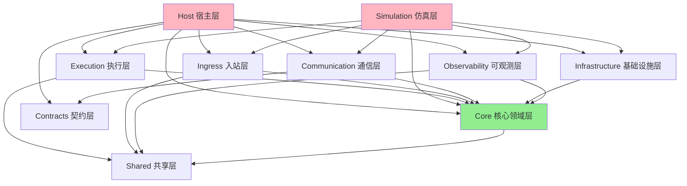
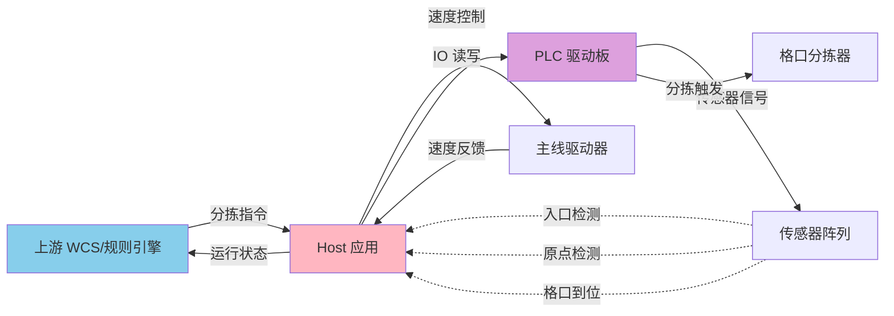
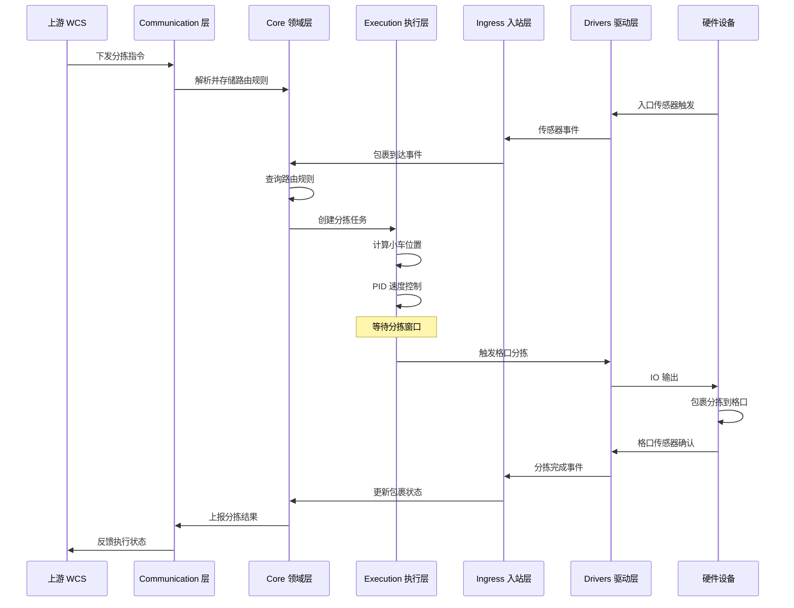
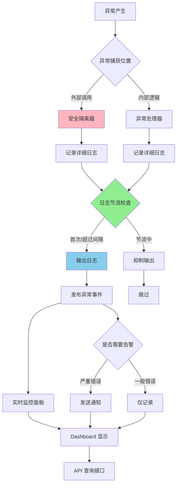

# ZakYip.NarrowBeltDiverterSorter

针对直线窄带分拣系统的专用项目 (Dedicated project for narrow belt diverter sorting system)

## 目录 (Table of Contents)

- [系统概览](#系统概览-system-overview)
- [项目结构](#项目结构-project-structure)
- [系统架构与拓扑](#系统架构与拓扑-system-architecture--topology)
- [异常处理与稳定性](#异常处理与稳定性-exception-handling--stability)
- [系统架构](#系统架构-system-architecture)
- [运行流程](#运行流程-execution-flow)
- [技术栈](#技术栈-technology-stack)
- [开发指南](#开发指南-development-guide)
- [项目规范与约束](#项目规范与约束-project-conventions-and-constraints)
- [文档导航](#文档导航-documentation-navigation)
- [贡献指南](#贡献指南-contributing)

## 系统概览 (System Overview)

本项目是一个高性能、可扩展的窄带分拣系统控制软件，采用分层架构设计，支持实时包裹跟踪、动态路由和多种硬件驱动。

### 核心特性

- ✅ 分层架构设计，各层职责清晰
- ✅ 支持仿真模式和真实硬件模式
- ✅ 实时可观测性（日志、事件总线、实时监控）
- ✅ 高可靠性（异常隔离、故障管理、安全控制）
- ✅ 灵活配置（LiteDB 持久化配置、API 动态更新）
- ✅ 完整测试覆盖（单元测试、集成测试、E2E 测试）

## 项目结构 (Project Structure)

本解决方案采用分层架构设计，各层职责清晰：

### 核心层 (Core Layers)

- **ZakYip.NarrowBeltDiverterSorter.Core**  
  领域模型与契约层，定义核心业务实体、接口和数据契约

- **ZakYip.NarrowBeltDiverterSorter.Execution**  
  执行逻辑层，包含主驱控制、PID 算法、小车追踪等核心执行逻辑

- **ZakYip.NarrowBeltDiverterSorter.Ingress**  
  入站处理层，负责 IO 监听、传感器数据解读和事件转发

- **ZakYip.NarrowBeltDiverterSorter.Drivers**  
  硬件驱动层，封装具体硬件设备的驱动接口

- **ZakYip.NarrowBeltDiverterSorter.Communication**  
  通信协议层，封装与上游系统/WCS 和驱动板的通信协议

- **ZakYip.NarrowBeltDiverterSorter.Observability**  
  可观测性层，提供日志、指标和追踪功能

- **ZakYip.NarrowBeltDiverterSorter.Host**  
  运行宿主层，支持 Windows 服务和控制台模式的应用程序入口

- **ZakYip.NarrowBeltDiverterSorter.Simulation**  
  仿真程序层，使用 Fake 实现替代真实硬件，模拟完整的分拣流程

### 测试项目 (Test Projects)

- **ZakYip.NarrowBeltDiverterSorter.Core.Tests**  
  Core 层单元测试

- **ZakYip.NarrowBeltDiverterSorter.Execution.Tests**  
  Execution 层单元测试

- **ZakYip.NarrowBeltDiverterSorter.Ingress.Tests**  
  Ingress 层单元测试

- **ZakYip.NarrowBeltDiverterSorter.Observability.Tests**  
  Observability 层单元测试

- **ZakYip.NarrowBeltDiverterSorter.E2ETests**  
  端到端集成测试

## 技术栈 (Technology Stack)

- .NET 8.0
- C# (with nullable reference types enabled)
- xUnit (for testing)

## 开发指南 (Development Guide)

### 本地一键验证 (Local One-Click Verification)

为确保代码质量，项目提供了一键构建和测试脚本，执行完整的验证流程：

**Windows (PowerShell)：**

```powershell
.\build.ps1
```

**Linux / macOS (Bash)：**

```bash
./build.sh
```

脚本会自动执行以下步骤：
1. 还原 NuGet 包
2. 编译解决方案（Release 模式，警告视为错误）
3. 运行所有测试（包括单元测试和 E2E 测试）

### 构建项目 (Build)

```bash
dotnet build
```

### 运行测试 (Run Tests)

```bash
dotnet test
```

#### 执行特定类别的测试

项目包含多种测试类别，可以通过过滤器选择性执行：

```bash
# 执行所有测试（包括单元测试、集成测试和仿真测试）
dotnet test

# 仅执行仿真测试（验证首车/格口/包裹绑定逻辑）
dotnet test --filter "TestCategory=Simulation"

# 仅执行小车绑定相关测试
dotnet test --filter "TestCategory=CartBinding"

# 执行仿真测试项目
dotnet test Tests/ZakYip.NarrowBeltDiverterSorter.Simulator.Tests
```

**仿真测试说明**：
- 仿真测试位于 `ZakYip.NarrowBeltDiverterSorter.Simulator.Tests` 项目
- 验证首车原点基准下的格口小车号计算、包裹绑定一致性、配置热更新和异常处理
- 覆盖场景：基础正确性、连续移动、热更新、异常场景
- 详细文档：[docs/NarrowBelt/CartNumberingAndChutes.md](docs/NarrowBelt/CartNumberingAndChutes.md#八仿真测试与回归验证)


### 运行宿主程序 (Run Host)

```bash
cd ZakYip.NarrowBeltDiverterSorter.Host
dotnet run
```

#### 启动模式 (Startup Modes)

宿主程序支持多种启动模式，便于逐步调试和验证系统：

**启动命令示例：**

```bash
# 正常模式（默认）- 启动所有服务
dotnet run --mode normal

# 主线调试模式 - 只启动主线控制和原点监控
dotnet run --mode bringup-mainline

# 入口调试模式 - 增加入口传感器和包裹装载
dotnet run --mode bringup-infeed

# 吐件调试模式 - 增加分拣执行和格口IO
dotnet run --mode bringup-chutes
```

详细说明请参考：[docs/BringUpGuide.md](docs/BringUpGuide.md)

#### 主线驱动配置 (Main Line Drive Configuration)

宿主程序支持通过配置文件切换主线驱动实现，无需修改代码：

**配置示例（appsettings.json）：**

```json
{
  "Sorter": {
    "MainLine": {
      "Implementation": "Simulation"  // 可选值: "Simulation" 或 "RemaLm1000H"
    }
  }
}
```

**可选实现类型：**

- **Simulation**: 仿真主线驱动
  - 用于开发和测试环境
  - 不依赖真实硬件
  - 模拟速度渐变和状态变化

- **RemaLm1000H**: 雷马 LM1000H 变频驱动器
  - 用于生产环境
  - 内置 PID 速度控制
  - 通过 Modbus RTU 协议通讯

**RemaLm1000H 配置参数：**

当使用 `RemaLm1000H` 实现时，需要配置以下参数（在 appsettings.json 的 `RemaLm1000H` 节中）：

```json
{
  "RemaLm1000H": {
    "LoopPeriod": "00:00:00.060",        // 控制循环周期（60ms）
    "LimitHz": 25.0,                      // 频率上限（Hz）
    "MinMmps": 0.0,                       // 最小速度（mm/s）
    "MaxMmps": 3000.0,                    // 最大速度（mm/s）
    "StableDeadbandMmps": 20.0,          // 稳定死区（mm/s）
    "StableHold": "00:00:01",            // 稳定保持时间
    "TorqueMax": 1000,                    // 最大扭矩（0-1000 = 0-100%额定电流）
    "Pid": {                              // PID 参数
      "Kp": 0.28,
      "Ki": 0.028,
      "Kd": 0.005
    }
  }
}
```

完整配置参数说明请参考 `RemaLm1000HOptions.cs` 中的注释。

**Rema 实机 Bring-up 调试：**

使用 Rema LM1000H 变频驱动器进行实机调试时，可以使用 Bring-up 模式获取详细的诊断信息：

```bash
# 启动主线调试模式
cd ZakYip.NarrowBeltDiverterSorter.Host
dotnet run --mode bringup-mainline
```

在 Bring-up 模式下，系统会每秒输出以下诊断信息：
- 串口配置和站号
- 最近一次成功下发的目标速度
- C0.26 反馈频率和换算后的线速度

这些信息可用于排查串口通讯问题、验证命令下发、检查编码器反馈等。

**详细的 Rema 实机调试指南请参考：[docs/RemaLm1000HBringUpGuide.md](docs/RemaLm1000HBringUpGuide.md)**

**启动日志：**

系统启动时会输出当前使用的主线驱动实现：

```
主线驱动实现: 仿真主线
```

或

```
主线驱动实现: Rema LM1000H
```

### 运行仿真程序 (Run Simulation)

仿真程序提供了一个完整的模拟环境，使用 Fake 实现替代真实硬件：

```bash
cd ZakYip.NarrowBeltDiverterSorter.Simulation
dotnet run
```

仿真功能包括：
- 模拟主线驱动和反馈
- 模拟小车运动和原点传感器
- 模拟入口传感器和包裹生成
- 模拟格口发信器和分拣过程
- 中文控制台日志输出

详细设计文档请参阅 [docs/Architecture/NarrowBeltDesign.md](docs/Architecture/NarrowBeltDesign.md)

## 项目规范与约束 (Project Conventions and Constraints)

本项目建立了一套完整的强制基线规范，覆盖架构、编码、通讯、日志、异常处理等所有方面。**所有贡献者和 GitHub Copilot 必须严格遵守这些规范。**

### 📌 核心规范文档

1. **[Copilot 强制约束规则](.github/copilot-instructions.md)**  
   GitHub Copilot 在生成或修改代码时必须遵守的 14 大类硬性规则，包括：
   - 通讯与重试策略（客户端无限重试，发送失败不重试）
   - API 设计与参数验证（必须使用特性标记）
   - 日志管理（节流、保留天数配置）
   - 架构分层（Host/Execution/Drivers 职责划分）
   - 时间使用规范（统一使用本地时间）
   - 异常安全隔离（使用安全隔离器）
   - 并发安全（线程安全集合）
   - C# 语言特性（required + init、record、readonly struct）

2. **[项目规则集](docs/Conventions/项目规则集.md)**  
   完整的项目规则文档（15 个主要章节），提供详细的正确/错误示例和验证方法

3. **[架构硬性规则](docs/Conventions/架构硬性规则.md)**  
   架构分层与依赖规则：
   - Host 层禁止实现业务逻辑
   - DI 注册完整性要求
   - 时间使用规则（必须使用 ILocalTimeProvider）
   - 异常处理规则（必须使用安全隔离器）
   - 线程安全规则（线程安全集合）
   - 语言特性规则（record、required + init、EventArgs 命名）

4. **[永久约束规则](docs/Conventions/永久约束规则.md)**  
   永久性技术约束：
   - Host 控制器依赖限制（禁止直接依赖 Infrastructure 具体类型）
   - 线程安全规则（必须使用线程安全集合）
   - 时间使用规则（不能使用 UTC 时间）
   - 异常安全规则（必须使用 SafetyIsolator）
   - 接口完整性规则

5. **[贡献指南 (CONTRIBUTING.md)](CONTRIBUTING.md)**  
   编码规范与命名约定：
   - 注释语言（中文）
   - 事件载荷命名（以 EventArgs 结尾）
   - 枚举类型（必须添加 Description 特性）
   - 布尔属性命名（Is/Has/Can/Should 前缀）
   - ID 类型约定（long 类型）
   - 技术偏好（.NET 8、LINQ 优先、性能优化）

### 🔒 强制约束要点

#### 1. 通讯重试策略
- ✅ 客户端连接失败：无限重试，最大退避 2 秒
- ✅ 发送失败：只记录日志，不重试
- ❌ 禁止修改为有限重试或发送重试

#### 2. API 参数验证
- ✅ 必须使用特性标记（`[Required]`、`[Range]` 等）
- ❌ 禁止仅依赖手写 if 判断

#### 3. Host 层打薄
- ✅ Host 层只负责 DI 配置和启动
- ❌ 禁止直接依赖 Infrastructure 具体类型
- ❌ 禁止包含业务逻辑

#### 4. 时间使用
- ✅ 统一使用本地时间（`ILocalTimeProvider`）
- ❌ 禁止使用 `DateTime.UtcNow`

#### 5. 异常安全
- ✅ 外部调用必须使用安全隔离器
- ✅ 异常只记录不崩溃

#### 6. 并发安全
- ✅ 多线程共享集合使用 `ConcurrentDictionary` 等
- ❌ 禁止使用非线程安全集合

#### 7. C# 语言特性
- ✅ DTO 使用 `record`
- ✅ 必填属性使用 `required + init`
- ✅ 事件载荷命名以 `EventArgs` 结尾

### 📝 PR 提交要求

所有 PR 必须：
- [ ] 通过所有基线规则检查（见 [PR 模板](.github/pull_request_template.md)）
- [ ] 构建成功（`dotnet build`）
- [ ] 测试通过（`dotnet test`）
- [ ] DI 验证测试通过
- [ ] 文档同步更新

**违反规则的 PR 将被拒绝，除非有明确的例外说明并获得批准。**

## 文档导航 (Documentation Navigation)

本项目采用分类文档结构，所有文档按职责分类存放。

### 📋 项目规范与约束文档

- **[Copilot 强制约束规则](.github/copilot-instructions.md)** - GitHub Copilot 必须遵守的硬性规则
- **[项目规则集](docs/Conventions/项目规则集.md)** - 完整的项目规则文档，覆盖所有方面
- **[并发安全与异常处理规范](docs/Conventions/并发安全与异常处理规范.md)** - 并发访问控制和异常隔离统一模式
- **[架构硬性规则](docs/Conventions/架构硬性规则.md)** - 架构分层与依赖规则
- **[永久约束规则](docs/Conventions/永久约束规则.md)** - DI、时间、异常、并发等约束
- **[贡献指南 (CONTRIBUTING.md)](CONTRIBUTING.md)** - 编码规范与命名约定

### 🏗️ 架构设计文档

存放在 `docs/Architecture/` 目录：

#### 核心架构文档
- **[系统拓扑图](docs/Architecture/系统拓扑图.md)** - 系统拓扑图，展示上游系统、Host、Execution、Drivers、小车/格口关系
- **[核心业务流程](docs/Architecture/核心业务流程.md)** - 核心业务流程图，从启动按钮到落格的完整流程
- **[异常处理流程](docs/Architecture/异常处理流程.md)** - 异常处理流程图，SafetyIsolator 使用和降级策略
- **[分层架构说明](docs/Architecture/分层架构说明.md)** - 分层架构详细说明，各层职责和依赖规则

#### 设计原则与规范
- **[分层架构设计原则](docs/Architecture/分层架构设计原则.md)** - 分层架构设计原则与规范
- **[项目依赖关系](docs/Architecture/项目依赖关系.md)** - 项目依赖关系与管理
- **[契约层设计](docs/Architecture/契约层设计.md)** - 契约层设计与接口定义

#### 系统设计文档
- **[SORTING_SYSTEM.md](docs/Architecture/SORTING_SYSTEM.md)** - 分拣系统架构文档
- **[窄带分拣机设计](docs/Architecture/窄带分拣机设计.md)** - 窄带分拣机设计文档
- **[ARCHITECTURE_BASELINE_SUMMARY.md](docs/Architecture/ARCHITECTURE_BASELINE_SUMMARY.md)** - 架构基线总结
- **[DOMAIN_PURIFICATION_SUMMARY_CN.md](docs/Architecture/DOMAIN_PURIFICATION_SUMMARY_CN.md)** - 领域层净化总结
- **[PORTS_ADAPTERS_REFACTORING_SUMMARY.md](docs/Architecture/PORTS_ADAPTERS_REFACTORING_SUMMARY.md)** - 端口适配器重构总结
- **[LiteDB_Configuration_Refactoring.md](docs/Architecture/LiteDB_Configuration_Refactoring.md)** - LiteDB 配置重构说明
- **[UPSTREAM_ROUTING_CONFIG_API.md](docs/Architecture/UPSTREAM_ROUTING_CONFIG_API.md)** - 上游路由配置 API

### 🚀 执行与运维文档

存放在 `docs/Operations/` 目录：

- **[分步调试指南](docs/Operations/分步调试指南.md)** - Bring-up 模式指南，包含逐步调试步骤
- **[Rema主线实机调试指南](docs/Operations/Rema主线实机调试指南.md)** - Rema LM1000H 主线实机 Bring-up 详细指南
- **[SAFETY_CONTROL.md](docs/Operations/SAFETY_CONTROL.md)** - 安全控制设计
- **[CHUTE_IO_SIMULATION.md](docs/Operations/CHUTE_IO_SIMULATION.md)** - 格口 IO 仿真
- **[格口IO架构](docs/Operations/格口IO架构.md)** - 格口 IO 架构
- **[SIGNALR_REALTIME_MONITORING.md](docs/Operations/SIGNALR_REALTIME_MONITORING.md)** - SignalR 实时监控
- **[REALTIME_MONITORING_PR_SUMMARY.md](docs/Operations/REALTIME_MONITORING_PR_SUMMARY.md)** - 实时监控 PR 总结
- **[RECORDING_REPLAY_README.md](docs/Operations/RECORDING_REPLAY_README.md)** - 录制回放功能说明
- **[RECORDING_REPLAY_SIMULATION_SETUP.md](docs/Operations/RECORDING_REPLAY_SIMULATION_SETUP.md)** - 录制回放仿真设置

### 🧪 仿真与测试文档

存放在 `docs/Simulation/` 和 `docs/NarrowBelt/` 目录：

- **[仿真测试说明](docs/Simulation/仿真测试说明.md)** - 仿真测试说明，包含1000包裹全链路测试详细文档
- **[小车编号与格口绑定](docs/NarrowBelt/小车编号与格口绑定.md)** - 小车编号与格口绑定系统详细说明

#### 1000包裹全链路仿真测试

本项目包含完整的1000包裹全链路仿真测试，覆盖从API配置启动按钮到包裹成功落格的完整流程。

**测试位置**: `Tests/ZakYip.NarrowBeltDiverterSorter.Simulator.Tests/Simulation/PanelStartToChuteDropSimulation/`

**运行测试**:
```bash
# 运行所有仿真测试
dotnet test Tests/ZakYip.NarrowBeltDiverterSorter.Simulator.Tests

# 仅运行1000包裹测试
dotnet test Tests/ZakYip.NarrowBeltDiverterSorter.Simulator.Tests \
  --filter "FullyQualifiedName~Should_CorrectlyIdentifyCarts_AndDropParcels_For1000Packages"

# 使用类别过滤运行仿真测试
dotnet test --filter "TestCategory=Simulation"
```

**测试验证点**:
- ✅ 小车IO识别正确（双IO算法）
- ✅ 包裹绑定上车号正确
- ✅ 落格车号与格口匹配正确
- ✅ 无漏落格、无误触发
- ✅ 所有1000个包裹成功处理

详细说明请参阅 [仿真测试文档](docs/Simulation/仿真测试说明.md)。

### 📚 实施总结文档

存放在 `docs/implementation-summaries/` 目录，包含各个功能模块的实施总结：

- **[IMPLEMENTATION_SUMMARY.md](docs/implementation-summaries/IMPLEMENTATION_SUMMARY.md)** - 总体实施总结
- **[PR1_RUNTIME_COMMUNICATION_REFACTOR_SUMMARY.md](docs/implementation-summaries/PR1_RUNTIME_COMMUNICATION_REFACTOR_SUMMARY.md)** - PR1 运行时通信重构
- **[PR2_IMPLEMENTATION_GUIDE.md](docs/implementation-summaries/PR2_IMPLEMENTATION_GUIDE.md)** - PR2 实施指南
- **[PR2_WORK_SUMMARY.md](docs/implementation-summaries/PR2_WORK_SUMMARY.md)** - PR2 工作总结
- **[PR4_IMPLEMENTATION_SUMMARY.md](docs/implementation-summaries/PR4_IMPLEMENTATION_SUMMARY.md)** - PR4 实施总结
- **[FAULT_MANAGEMENT_IMPLEMENTATION_SUMMARY.md](docs/implementation-summaries/FAULT_MANAGEMENT_IMPLEMENTATION_SUMMARY.md)** - 故障管理实施
- **[FEEDING_BACKPRESSURE_IMPLEMENTATION.md](docs/implementation-summaries/FEEDING_BACKPRESSURE_IMPLEMENTATION.md)** - 供料背压实施
- **[RECORDING_REPLAY_IMPLEMENTATION_SUMMARY.md](docs/implementation-summaries/RECORDING_REPLAY_IMPLEMENTATION_SUMMARY.md)** - 录制回放实施
- **[SHARED_LAYER_IMPLEMENTATION_SUMMARY.md](docs/implementation-summaries/SHARED_LAYER_IMPLEMENTATION_SUMMARY.md)** - 共享层实施
- **[TECHNICAL_DEBT_CLEANUP_SUMMARY.md](docs/implementation-summaries/TECHNICAL_DEBT_CLEANUP_SUMMARY.md)** - 技术债清理
- **[UPSTREAM_RULE_ENGINE_PORT_IMPLEMENTATION.md](docs/implementation-summaries/UPSTREAM_RULE_ENGINE_PORT_IMPLEMENTATION.md)** - 上游规则引擎端口实施

## 贡献指南 (Contributing)

在贡献代码前，**必须**阅读以下规范文档：

### 📚 必读规范文档

1. **[Copilot 强制约束规则](.github/copilot-instructions.md)** - GitHub Copilot 必须遵守的硬性规则
2. **[项目规则集](docs/Conventions/项目规则集.md)** - 完整的项目规则文档
3. **[并发安全与异常处理规范](docs/Conventions/并发安全与异常处理规范.md)** - 并发控制与异常隔离（**必读**）
4. **[架构硬性规则](docs/Conventions/架构硬性规则.md)** - 架构分层与依赖规则（**必读**）
5. **[永久约束规则](docs/Conventions/永久约束规则.md)** - 技术约束规则
6. **[贡献指南](CONTRIBUTING.md)** - 编码规范与命名约定

### ✅ 贡献前检查清单

提交 PR 前，请确认：

- [ ] 已阅读所有规范文档
- [ ] 代码符合架构分层原则（Host 层打薄、依赖抽象接口）
- [ ] 时间使用本地时间，未使用 UTC
- [ ] 外部调用使用安全隔离器
- [ ] 多线程共享集合使用线程安全类型
- [ ] API 参数使用特性标记验证
- [ ] DTO 使用 `record`，对象使用 `required + init`
- [ ] 事件载荷命名以 `EventArgs` 结尾
- [ ] 构建成功（`dotnet build`）
- [ ] 所有测试通过（`dotnet test`）
- [ ] 文档已同步更新

### 🚫 常见违规提醒

**禁止的行为**：
- ❌ Host 控制器直接依赖 Infrastructure 具体类型
- ❌ 使用 `DateTime.UtcNow`
- ❌ 外部调用不使用安全隔离器
- ❌ 多线程共享使用非线程安全集合（如 `Dictionary`）
- ❌ API 参数仅用 if 语句校验
- ❌ 修改通讯重试策略（客户端无限重试，发送失败不重试）

### 📝 提交 PR

使用 [PR 模板](.github/pull_request_template.md) 提交 PR，确保勾选所有适用的检查项。

**我们期待您的贡献！** 🎉

## 系统架构与拓扑 (System Architecture & Topology)

本项目采用严格的分层架构设计，确保各层职责清晰、依赖方向正确。

### 📐 核心架构文档

- **[系统拓扑图](docs/Architecture/系统拓扑图.md)** - 完整的系统组件拓扑，包含上游系统、Host、Execution、Drivers、小车/格口关系、数据流向
- **[核心业务流程](docs/Architecture/核心业务流程.md)** - 从启动按钮 → 数小车 → 包裹创建 → 绑定 → 落格的完整流程
- **[分层架构说明](docs/Architecture/分层架构说明.md)** - 各层职责、依赖规则和最佳实践

### 🔄 业务流程概览

系统完整的分拣流程包括以下关键阶段：

1. **启动与初始化**: API 配置电柜面板启动按钮，系统进入 Running 状态
2. **小车识别**: 通过双 IO 传感器识别首车（0号车）和普通车，维护环形数组
3. **包裹上料**: 入口传感器触发，创建包裹实体，查询路由规则
4. **车号绑定**: 根据当前首车位置和格口基准车号，计算目标车号并绑定包裹
5. **窗口匹配**: 实时追踪小车位置，当目标车号到达格口时触发窗口
6. **格口触发**: DO 输出触发格口发信器，包裹滑落到目标格口
7. **落格确认**: 格口传感器确认包裹成功落格
8. **结果上报**: 通过 Communication 层上报分拣结果到上游 WCS

详细流程请参阅 [核心业务流程文档](docs/Architecture/核心业务流程.md)。

---

## 异常处理与稳定性 (Exception Handling & Stability)

本系统设计了完善的异常处理机制，确保在任何异常情况下都不会崩溃，并能快速降级和恢复。

### 🛡️ 异常处理策略

- **[异常处理流程](docs/Architecture/异常处理流程.md)** - 完整的异常处理流程图和最佳实践

### 核心机制

#### SafetyIsolator（安全隔离器）
所有外部调用（上游通信、硬件驱动、配置存储）必须使用 `SafetyIsolator` 包裹：

```csharp
var success = await _isolator.ExecuteAsync(
    async () => await _hardware.WriteAsync(data),
    onError: ex => _logger.LogError(ex, "写入失败"),
    defaultValue: false
);
```

#### ThrottledLogger（节流日志）
避免日志洪水，相同内容至少间隔 1 秒才再次记录：

```csharp
_throttledLogger.LogError(ex, "上游连接失败");
// 相同错误在1秒内不会重复输出
```

#### 降级模式
各组件支持自动降级和恢复：

| 组件 | 正常模式 | 降级模式 | 恢复机制 |
|------|----------|----------|----------|
| 上游通信 | TCP连接 | 队列缓存 | 无限重试，指数退避 |
| 主线驱动 | Rema VFD | 固定速度 | 定时Ping检查 |
| 格口发信器 | 实时触发 | 时间估算 | 自动重试 |
| 配置存储 | LiteDB | 内存缓存 | 文件锁解除后恢复 |

#### 重试策略
- ✅ **连接失败**: 无限重试，最大退避 2 秒
- ❌ **发送失败**: 不重试，仅记录日志

详细说明请参阅 [异常处理流程文档](docs/Architecture/异常处理流程.md)。

---

## 系统架构 (System Architecture)

### 项目依赖图



### 系统拓扑图



## 运行流程 (Execution Flow)

### 完整分拣流程



### 异常处理流程



## 技术栈 (Technology Stack)

- .NET 8.0
- C# 12 (with nullable reference types enabled)
- xUnit (for testing)
- LiteDB (for configuration persistence)
- SignalR (for real-time monitoring)
- Modbus RTU (for hardware communication)

## 开发指南 (Development Guide)

- [BringUpGuide.md](docs/BringUpGuide.md) - Bring-up 模式指南，包含逐步调试步骤
- [RemaLm1000HBringUpGuide.md](docs/RemaLm1000HBringUpGuide.md) - Rema LM1000H 主线实机 Bring-up 详细指南
- [NarrowBeltDesign.md](docs/NarrowBeltDesign.md) - 窄带分拣机设计文档，包含：
  - 与 WheelDiverterSorter 的异同对比
  - 双 IO 数小车算法说明
  - 入口 IO 到落车的时间-位置换算
  - 主驱稳速与格口发信器窗口控制
  - 强排口清空策略
- [SAFETY_CONTROL.md](SAFETY_CONTROL.md) - 安全控制设计
- [SORTING_SYSTEM.md](SORTING_SYSTEM.md) - 分拣系统实现文档