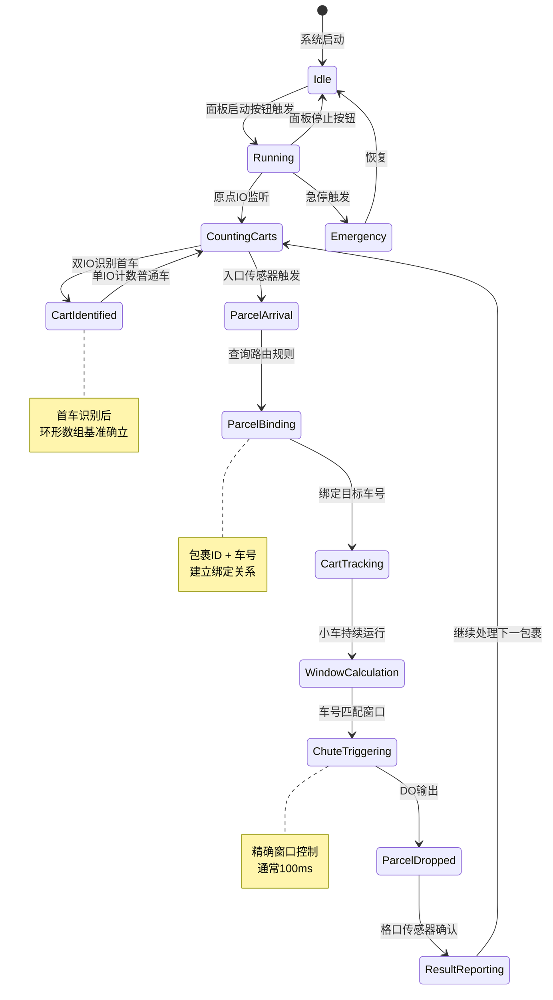
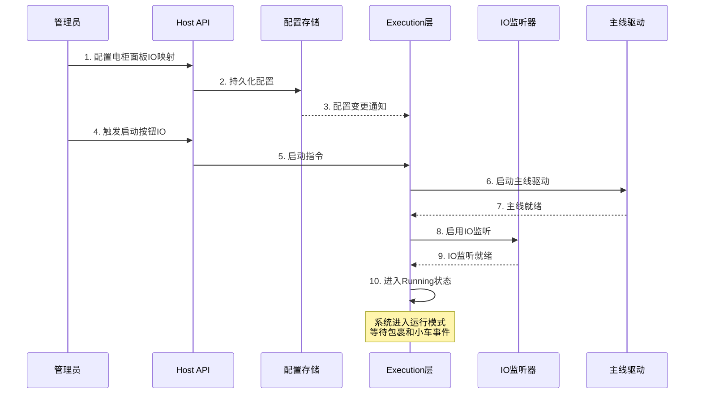
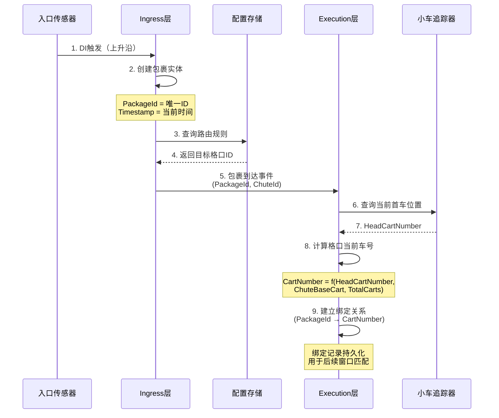
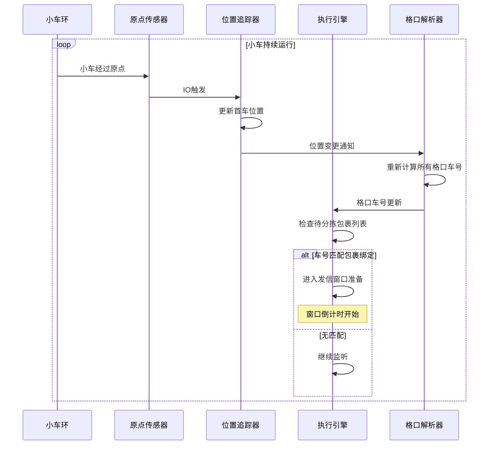
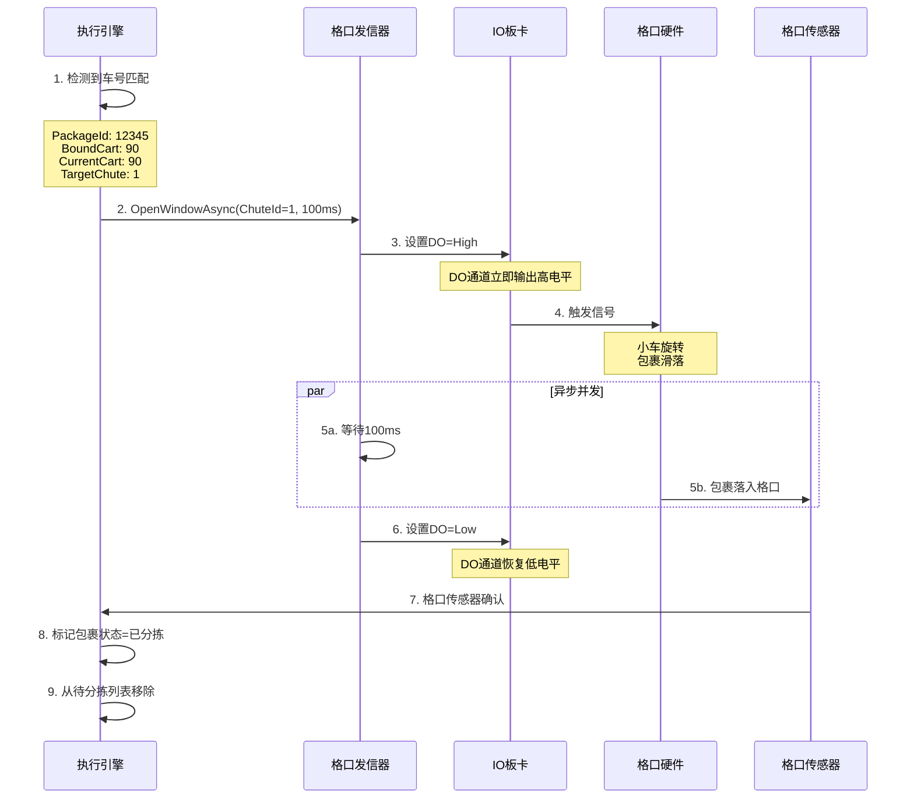
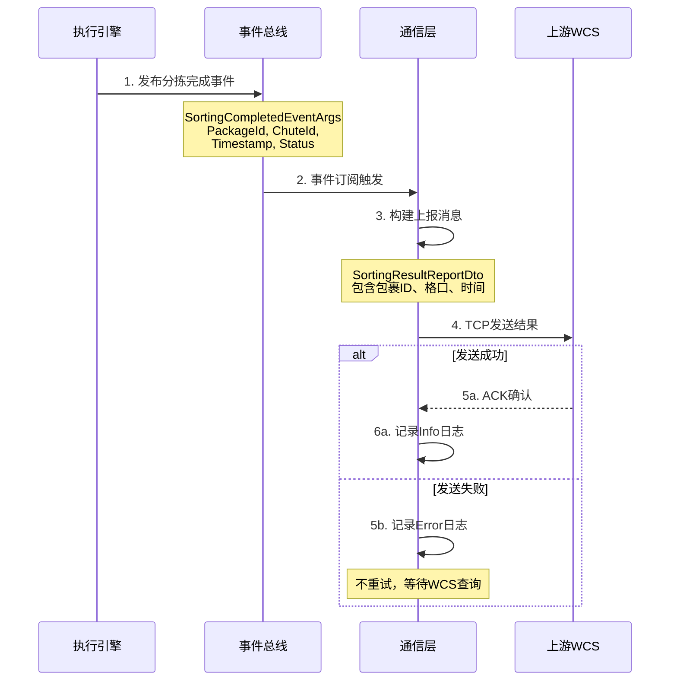
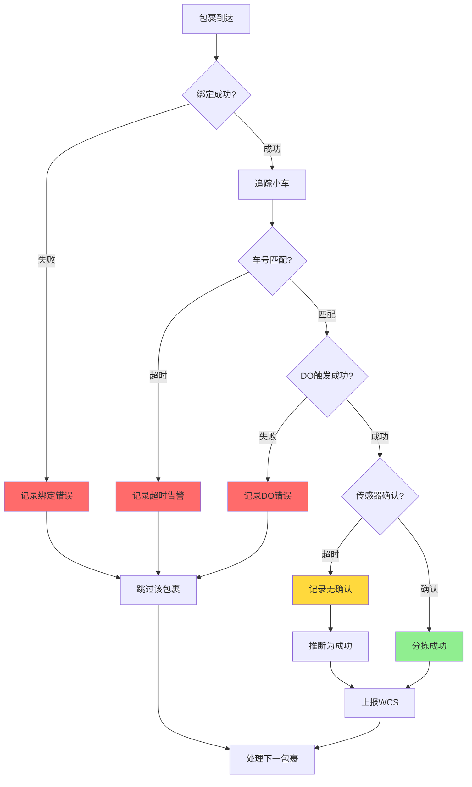

# 核心业务流程 (Core Business Flow)

## 概述

本文档详细描述窄带分拣系统从启动到完成分拣的完整业务流程，包括状态转换、关键节点和时序逻辑。

---

## 完整分拣流程概览



---

## 阶段一：系统启动与初始化

### 启动流程



### 关键配置项
- **面板启动按钮**: DI通道号
- **面板停止按钮**: DI通道号
- **急停按钮**: DI通道号
- **运行指示灯**: DO通道号

---

## 阶段二：小车识别与位置追踪

### 双IO识别算法

```mermaid
flowchart TD
    Start[原点IO触发] --> CheckBoth{双IO同时触发?}
    
    CheckBoth -->|是| ZeroCar[识别为0号车]
    CheckBoth -->|否| RegularCar[识别为普通车]
    
    ZeroCar --> ResetCounter[计数器归零]
    RegularCar --> IncrementCounter[计数器+1]
    
    ResetCounter --> UpdateHead[更新首车位置 = 1]
    IncrementCounter --> CalcHead[计算首车位置<br/>= (当前位置 + 1) mod 总车数]
    
    UpdateHead --> NotifyExec[通知Execution层]
    CalcHead --> NotifyExec
    
    NotifyExec --> UpdateBindings[更新所有格口当前车号]
    UpdateBindings --> End[继续监听]
    
    style ZeroCar fill:#90EE90
    style RegularCar fill:#87CEEB
```

### 环形数组维护

**数据结构**:
```
环形数组: [1, 2, 3, ..., 100, 1, 2, ...] (循环)
首车索引: CurrentOriginCartIndex (0-based)
首车编号: HeadCartNumber = CurrentOriginCartIndex + 1
```

**更新公式**:
```
当检测到普通车:
  CurrentOriginCartIndex = (CurrentOriginCartIndex + 1) mod TotalCartCount

当检测到0号车:
  CurrentOriginCartIndex = 0
```

---

## 阶段三：包裹上料与绑定

### 包裹创建流程



### 格口车号计算公式

给定：
- `TotalCartCount`: 总小车数量（如100）
- `HeadCartNumber`: 当前首车编号（1-based）
- `CartNumberWhenHeadAtOrigin`: 格口基准车号（1-based）

计算格口当前车号：
```
zeroBasedHead = HeadCartNumber - 1
zeroBasedChuteBase = CartNumberWhenHeadAtOrigin - 1
zeroBasedResult = (zeroBasedChuteBase + zeroBasedHead) mod TotalCartCount
CartNumber = zeroBasedResult + 1
```

**示例**:
- TotalCartCount = 100
- HeadCartNumber = 5（当前5号车在原点）
- 格口1的 CartNumberWhenHeadAtOrigin = 90

则格口1当前车号 = ((90-1) + (5-1)) mod 100 + 1 = 94

---

## 阶段四：小车运行与窗口计算

### 实时位置更新



### 窗口精确控制

**窗口计算**:
1. 包裹绑定车号 = N
2. 格口当前车号 = M
3. 当 M == N 时，进入发信窗口
4. 窗口持续时间：通常100ms

**时间容错**:
- 允许±10ms的时间误差
- 通过PID控制主线速度，减小速度波动
- 窗口时间可通过API配置

---

## 阶段五：格口触发与落格确认

### DO触发时序



### 落格确认逻辑

**正常流程**:
1. DO触发后，等待格口传感器确认
2. 超时时间：500ms（可配置）
3. 确认后，标记包裹为"已完成"

**异常情况**:
- **超时无确认**: 记录告警，但不阻塞后续包裹
- **DO失败**: 使用SafetyIsolator捕获，记录日志
- **传感器故障**: 降级为"基于DO时间推断"模式

---

## 阶段六：结果上报

### 上报时序



### 上报数据结构

```json
{
  "packageId": "PKG-12345",
  "targetChuteId": 1,
  "actualChuteId": 1,
  "sortedAt": "2025-11-21T08:30:15.123Z",
  "status": "Success",
  "cartNumber": 90,
  "duration": 125
}
```

---

## 关键性能指标

### 时间节点
1. **包裹上料 → 绑定**: &lt; 10ms
2. **绑定 → 窗口匹配**: 取决于小车环运行时间
3. **窗口匹配 → DO触发**: &lt; 5ms
4. **DO触发 → 落格确认**: 100ms（窗口时间） + 50ms（传感器延迟）
5. **落格确认 → 上报WCS**: &lt; 100ms

### 吞吐量
- **理论上限**: 受小车间距和速度限制
- **实测**: 100个小车环，速度3000mm/s，约60包裹/分钟
- **瓶颈**: 上料间隔和格口发信器恢复时间

---

## 异常流程处理

### 关键异常点



详细异常处理策略请参考 [异常处理流程文档](./ExceptionHandlingFlow.md)。

---

## 仿真验证

### 1000包裹全链路测试

测试覆盖完整流程：
1. ✅ 面板启动按钮配置（通过API）
2. ✅ 小车IO识别（双IO算法）
3. ✅ 包裹创建与绑定（1000个包裹）
4. ✅ 小车环运行（环形数组维护）
5. ✅ 窗口匹配与DO触发（精确时序）
6. ✅ 落格确认（传感器验证）

测试断言：
- 每个包裹绑定车号正确
- 落格格口与目标格口一致
- 无漏落格、无误触发
- 车号与格口对应关系正确

详细测试说明请参考 [仿真测试文档](../Simulation/SimulationTesting.md)。

---

## 参考文档

- [系统拓扑图](./SystemTopology.md)
- [异常处理流程](./ExceptionHandlingFlow.md)
- [分层架构说明](./LayeredArchitecture.md)
- [小车编号与格口绑定](../NarrowBelt/CartNumberingAndChutes.md)
- [窄带分拣机设计](./NarrowBeltDesign.md)

---

**版本**: v1.0  
**最后更新**: 2025-11-21  
**维护者**: ZakYip Team
