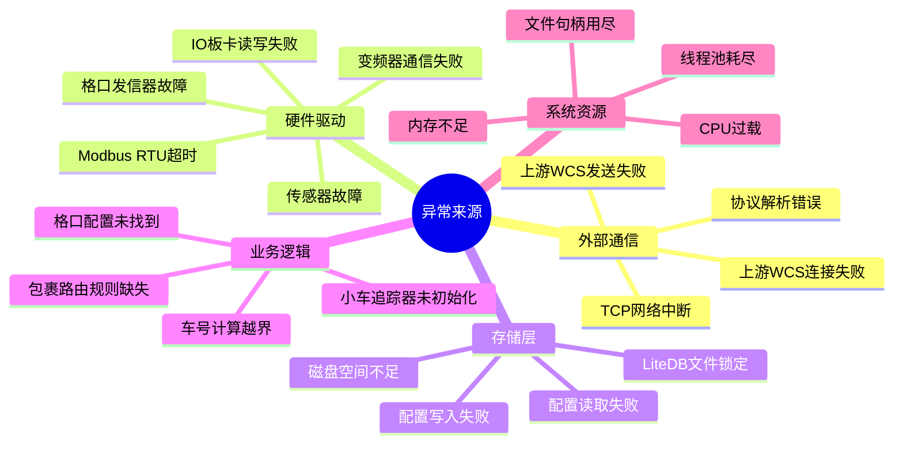
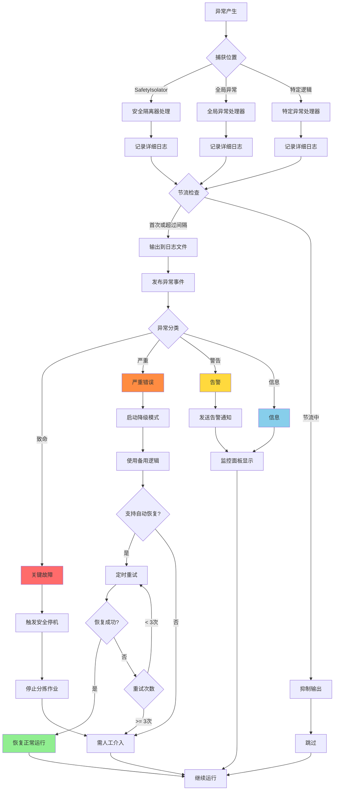
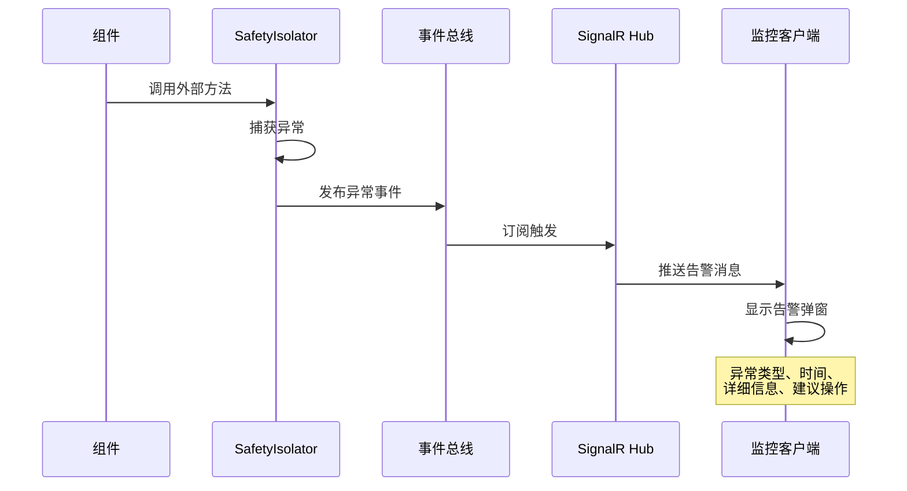

# 异常处理流程 (Exception Handling Flow)

## 概述

本文档详细说明窄带分拣系统的异常处理机制，包括异常来源、捕获策略、日志记录、降级模式和恢复流程。

---

## 异常处理原则

### 核心原则
1. **绝不崩溃**: 任何异常都只记录，不导致应用崩溃
2. **安全隔离**: 使用 `SafetyIsolator` 包裹所有外部调用
3. **节流日志**: 相同异常至少间隔1秒才再次记录
4. **快速降级**: 异常发生时立即切换到降级模式
5. **自动恢复**: 支持自动重试和恢复机制

---

## 异常来源分类



---

## 异常捕获与隔离

### SafetyIsolator 使用

#### 基本用法

```csharp
// 同步调用隔离
var success = _isolator.Execute(
    action: () => _hardware.WriteData(data),
    onError: ex => _logger.LogError(ex, "硬件写入失败"),
    defaultValue: false
);

// 异步调用隔离
var result = await _isolator.ExecuteAsync(
    asyncAction: async () => await _upstreamClient.SendAsync(message),
    onError: ex => _logger.LogError(ex, "上游发送失败"),
    defaultValue: null
);
```

#### 关键场景应用

**场景1: 上游通信**
```csharp
public async Task<bool> SendSortingResultAsync(SortingResultReportDto report)
{
    return await _isolator.ExecuteAsync(
        asyncAction: async () =>
        {
            await _tcpClient.SendAsync(JsonSerializer.Serialize(report));
            return true;
        },
        onError: ex =>
        {
            _throttledLogger.LogError(ex, 
                "上报分拣结果失败: PackageId={PackageId}, ChuteId={ChuteId}",
                report.PackageId, report.ChuteId);
        },
        defaultValue: false
    );
}
```

**场景2: 硬件驱动**
```csharp
public async Task<bool> SetMainLineSpeedAsync(double speedMmps)
{
    return await _isolator.ExecuteAsync(
        asyncAction: async () =>
        {
            await _vfd.SetFrequencyAsync(ConvertSpeedToHz(speedMmps));
            return true;
        },
        onError: ex =>
        {
            _throttledLogger.LogError(ex, 
                "设置主线速度失败: TargetSpeed={SpeedMmps}mm/s", speedMmps);
            // 触发降级模式
            _faultManager.ReportFault(FaultType.MainLineDriveFault);
        },
        defaultValue: false
    );
}
```

**场景3: 配置存储**
```csharp
public ChuteConfig GetChuteConfig(ChuteId chuteId)
{
    return _isolator.Execute(
        action: () => _configStore.GetChuteConfig(chuteId),
        onError: ex =>
        {
            _throttledLogger.LogError(ex, 
                "读取格口配置失败: ChuteId={ChuteId}", chuteId);
        },
        defaultValue: CreateDefaultChuteConfig(chuteId)
    );
}
```

---

## 异常处理流程图

### 完整异常处理流程



---

## 日志管理

### 日志级别定义

| 级别 | 场景 | 示例 | 保留时长 |
|------|------|------|----------|
| **Trace** | 详细调试信息 | 进入/退出方法 | 不记录到文件 |
| **Debug** | 调试信息 | 参数值、中间状态 | 1天 |
| **Information** | 正常运行信息 | 包裹分拣成功、配置更新 | 3天 |
| **Warning** | 潜在问题 | 重试成功、配置缺失使用默认值 | 7天 |
| **Error** | 错误但可恢复 | 硬件通信失败、包裹绑定失败 | 30天 |
| **Critical** | 致命错误 | 数据库损坏、内存耗尽 | 永久保留 |

### 节流日志配置

```csharp
// 在 ThrottledLogger 中配置
public sealed class ThrottledLogger : ILogger
{
    private readonly TimeSpan _throttleInterval = TimeSpan.FromSeconds(1);
    private readonly ConcurrentDictionary<string, DateTimeOffset> _lastLogTime = new();
    
    public void Log<TState>(
        LogLevel logLevel,
        EventId eventId,
        TState state,
        Exception? exception,
        Func<TState, Exception?, string> formatter)
    {
        var message = formatter(state, exception);
        var key = $"{logLevel}:{message}";
        
        var now = DateTimeOffset.Now;
        
        if (_lastLogTime.TryGetValue(key, out var lastTime))
        {
            if (now - lastTime < _throttleInterval)
            {
                // 节流：跳过此次日志
                return;
            }
        }
        
        _lastLogTime[key] = now;
        _innerLogger.Log(logLevel, eventId, state, exception, formatter);
    }
}
```

### 日志保留策略

**配置示例 (appsettings.json)**:
```json
{
  "Logging": {
    "Retention": {
      "DefaultDays": 3,
      "ByLevel": {
        "Debug": 1,
        "Information": 3,
        "Warning": 7,
        "Error": 30,
        "Critical": -1
      }
    },
    "MaxFileSizeMB": 100,
    "MaxRollingFiles": 10
  }
}
```

---

## 降级模式

### 降级策略表

| 组件 | 正常模式 | 降级模式 | 触发条件 |
|------|----------|----------|----------|
| **上游通信** | TCP连接 | 队列缓存 | 连接失败超过10次 |
| **主线驱动** | Rema VFD | 固定速度 | Modbus通信失败 |
| **格口发信器** | 实时触发 | 时间估算 | IO写入失败 |
| **小车追踪** | IO监听 | 时间推算 | 传感器故障 |
| **配置存储** | LiteDB | 内存缓存 | 数据库锁定 |

### 降级实现示例

**主线驱动降级**:
```csharp
public sealed class MainLineDriveCoordinator
{
    private bool _isInDegradedMode = false;
    private const double FallbackSpeedMmps = 2000.0; // 降级速度
    
    public async Task<bool> SetSpeedAsync(double targetSpeedMmps)
    {
        if (_isInDegradedMode)
        {
            _logger.LogWarning(
                "主线驱动处于降级模式，使用固定速度: {Speed}mm/s", 
                FallbackSpeedMmps);
            return true; // 假装成功
        }
        
        var success = await _isolator.ExecuteAsync(
            async () => await _drive.SetSpeedAsync(targetSpeedMmps),
            ex =>
            {
                _logger.LogError(ex, "设置主线速度失败");
                EnterDegradedMode();
            },
            defaultValue: false
        );
        
        return success;
    }
    
    private void EnterDegradedMode()
    {
        _isInDegradedMode = true;
        _faultManager.ReportFault(FaultType.MainLineDriveFault);
        
        // 启动定时恢复检查
        _ = Task.Run(async () =>
        {
            while (_isInDegradedMode)
            {
                await Task.Delay(TimeSpan.FromSeconds(10));
                await TryRecoverAsync();
            }
        });
    }
    
    private async Task TryRecoverAsync()
    {
        var canConnect = await _isolator.ExecuteAsync(
            async () => await _drive.PingAsync(),
            ex => _logger.LogDebug("恢复检查失败: {Error}", ex.Message),
            defaultValue: false
        );
        
        if (canConnect)
        {
            _isInDegradedMode = false;
            _logger.LogInformation("主线驱动已恢复正常");
            _faultManager.ClearFault(FaultType.MainLineDriveFault);
        }
    }
}
```

---

## 重试策略

### 连接重试（客户端）

**无限重试 + 指数退避**:
```csharp
public sealed class UpstreamTcpClient
{
    private readonly TimeSpan _maxBackoff = TimeSpan.FromSeconds(2);
    
    public async Task ConnectAsync(CancellationToken ct)
    {
        int attempt = 0;
        
        while (!ct.IsCancellationRequested)
        {
            try
            {
                await _client.ConnectAsync(_host, _port, ct);
                _logger.LogInformation("连接上游成功");
                return;
            }
            catch (Exception ex)
            {
                attempt++;
                var backoff = CalculateBackoff(attempt);
                
                _throttledLogger.LogWarning(ex,
                    "连接上游失败，第 {Attempt} 次尝试，{Backoff}ms 后重试",
                    attempt, backoff.TotalMilliseconds);
                
                await Task.Delay(backoff, ct);
            }
        }
    }
    
    private TimeSpan CalculateBackoff(int attempt)
    {
        // 指数退避: 100ms, 200ms, 400ms, 800ms, 1600ms, 2000ms (max)
        var backoff = TimeSpan.FromMilliseconds(100 * Math.Pow(2, attempt - 1));
        return backoff > _maxBackoff ? _maxBackoff : backoff;
    }
}
```

**重要规则**:
- ✅ **连接失败**: 无限重试
- ❌ **发送失败**: 不重试，仅记录日志

### 热更新支持

**配置更新触发重连**:
```csharp
public void OnConfigChanged(UpstreamConnectionConfig newConfig)
{
    _logger.LogInformation(
        "上游连接配置已更新: {Host}:{Port}", 
        newConfig.Host, newConfig.Port);
    
    // 断开当前连接
    _client.Disconnect();
    
    // 使用新配置重新连接（自动触发无限重试）
    _ = ConnectAsync(_cancellationToken);
}
```

---

## 异常通知机制

### 实时监控推送



### 告警消息结构

```json
{
  "alertId": "ALT-20251121-001",
  "timestamp": "2025-11-21T08:30:15.123Z",
  "level": "Error",
  "component": "MainLineDrive",
  "message": "Modbus RTU 通信超时",
  "details": {
    "slaveAddress": 1,
    "registerAddress": "C0.01",
    "attemptCount": 3,
    "lastError": "IOException: Port not responding"
  },
  "suggestedAction": "检查串口连接和变频器电源",
  "autoRecoveryEnabled": true
}
```

---

## 健康检查

### 健康检查端点

```csharp
[HttpGet("/health")]
public IActionResult GetHealth()
{
    var health = new HealthStatus
    {
        Overall = "Healthy",
        Components = new[]
        {
            CheckUpstreamConnection(),
            CheckMainLineDrive(),
            CheckIoBoard(),
            CheckConfigStore(),
            CheckCartTracker()
        }
    };
    
    if (health.Components.Any(c => c.Status == "Unhealthy"))
    {
        health.Overall = "Unhealthy";
        return StatusCode(503, health);
    }
    
    if (health.Components.Any(c => c.Status == "Degraded"))
    {
        health.Overall = "Degraded";
    }
    
    return Ok(health);
}
```

### 健康状态定义

| 状态 | 定义 | 响应码 |
|------|------|--------|
| **Healthy** | 所有组件正常 | 200 |
| **Degraded** | 部分组件降级但可用 | 200 |
| **Unhealthy** | 关键组件故障 | 503 |

---

## 仿真验证

### 异常场景测试

**测试覆盖**:
1. ✅ 格口配置未找到 → 使用默认配置
2. ✅ 小车追踪器未初始化 → 抛出中文异常
3. ✅ 车号越界 → 抛出验证异常
4. ✅ 绑定失败 → 跳过包裹，继续处理
5. ✅ DO触发失败 → 记录日志，不阻塞

**测试位置**: `Tests/ZakYip.NarrowBeltDiverterSorter.Simulator.Tests/Simulation/CartAtChuteBinding/ErrorScenarioSimulationTests.cs`

---

## 最佳实践

### DO's ✅
- 使用 `SafetyIsolator` 包裹所有外部调用
- 使用 `ThrottledLogger` 避免日志洪水
- 提供有意义的中文错误消息
- 记录足够的上下文信息（参数、状态）
- 设计降级模式和恢复机制

### DON'Ts ❌
- 不要让异常未处理导致应用崩溃
- 不要在热路径使用昂贵的异常处理
- 不要重复记录相同的异常（使用节流）
- 不要吞掉异常而不记录日志
- 不要在生产环境使用 `Debug` 级别

---

## 参考文档

- [系统拓扑图](./SystemTopology.md)
- [核心业务流程](./CoreBusinessFlow.md)
- [并发安全与异常处理规范](../Conventions/ConcurrencyAndExceptionHandling.md)
- [架构硬性规则](../../ARCHITECTURE_RULES.md)
- [永久约束规则](../../PERMANENT_CONSTRAINTS.md)

---

**版本**: v1.0  
**最后更新**: 2025-11-21  
**维护者**: ZakYip Team
