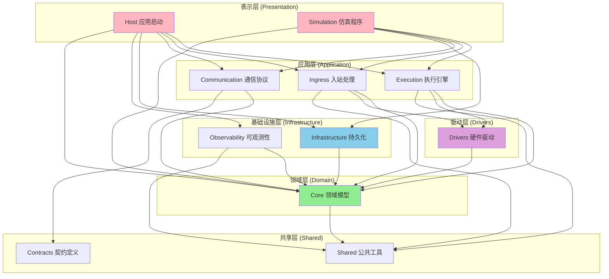

# 分层架构说明 (Layered Architecture)

## 概述

本文档详细说明窄带分拣系统的分层架构设计、各层职责、依赖规则和最佳实践。本文档与 [Layering.md](./Layering.md) 互补，提供更具体的实现指导。

---

## 架构全景图



---

## 各层详细说明

### 1. Host 层（表示层）

#### 职责
- 应用程序入口和启动配置
- 依赖注入（DI）容器配置
- REST API 端点定义（仅路由，不含逻辑）
- SignalR Hub 定义
- 中间件管道配置
- 配置文件读取

#### 硬性约束 ❌
- **禁止**: 包含业务逻辑
- **禁止**: 直接依赖 `Infrastructure.*` 具体类型
- **禁止**: 直接依赖具体驱动实现
- **禁止**: 定义领域实体或复杂类型

#### 允许的依赖 ✅
- Core 层接口（如 `IConfigurationStore`）
- Application 层接口（如 `IExecutionEngine`）
- Contracts 层 DTO

#### 示例：正确的 Host 控制器

```csharp
// ✅ 正确：仅依赖接口
[ApiController]
[Route("api/[controller]")]
public class ConfigController : ControllerBase
{
    private readonly IConfigurationStore _configStore; // Core 层接口
    private readonly ILogger<ConfigController> _logger;
    
    public ConfigController(
        IConfigurationStore configStore,
        ILogger<ConfigController> logger)
    {
        _configStore = configStore;
        _logger = logger;
    }
    
    [HttpGet]
    public IActionResult GetConfig()
    {
        var config = _configStore.GetAllConfigs();
        return Ok(config);
    }
}
```

```csharp
// ❌ 错误：直接依赖 Infrastructure 具体类型
public class ConfigController : ControllerBase
{
    private readonly LiteDbConfigurationStore _store; // ❌ 违规
    
    public ConfigController(LiteDbConfigurationStore store)
    {
        _store = store;
    }
}
```

#### DI 注册示例

```csharp
// Program.cs 或 Startup.cs
public void ConfigureServices(IServiceCollection services)
{
    // Core 接口 → Infrastructure 实现
    services.AddSingleton<IConfigurationStore, LiteDbConfigurationStore>();
    
    // Application 接口 → Execution 实现
    services.AddSingleton<ICartPositionTracker, CartPositionTracker>();
    
    // 配置选项
    services.Configure<SorterOptions>(Configuration.GetSection("Sorter"));
    
    // 根据配置选择实现
    var mainLineImpl = Configuration["Sorter:MainLine:Implementation"];
    if (mainLineImpl == "RemaLm1000H")
    {
        services.AddSingleton<IMainLineDrive, RemaLm1000HMainLineDrive>();
    }
    else
    {
        services.AddSingleton<IMainLineDrive, SimulationMainLineDrive>();
    }
}
```

---

### 2. Execution 层（应用层）

#### 职责
- 核心业务流程编排
- 小车位置追踪和计算
- 包裹-小车绑定逻辑
- PID 速度控制算法
- 格口窗口触发控制
- 分拣任务调度

#### 关键组件

**CartPositionTracker（小车位置追踪器）**
- 监听原点 IO 事件
- 维护环形数组（1-based 索引）
- 双 IO 识别首车
- 提供当前首车位置查询

**PackageCartBinder（包裹-小车绑定器）**
- 包裹上料时绑定车号
- 调用 `ICartAtChuteResolver` 计算目标车号
- 维护绑定关系映射

**ChuteCartNumberCalculator（格口车号计算器）**
- 实现环形数组计算公式
- 处理跨越边界的模运算
- 支持 1-based 索引

**MainLineSpeedController（主线速度控制器）**
- PID 算法实现
- 根据包裹密度调整速度
- 通过 `IMainLineDrive` 接口下发指令

#### 依赖规则
- ✅ 依赖 Core 层接口
- ✅ 依赖 Shared 层工具
- ✅ 通过接口调用 Drivers 层
- ❌ 不直接依赖 Infrastructure 具体类型

#### 示例：Execution 层组件

```csharp
public sealed class PackageCartBinder
{
    private readonly ICartAtChuteResolver _resolver;
    private readonly ILogger<PackageCartBinder> _logger;
    private readonly ConcurrentDictionary<long, int> _bindings = new();
    
    public PackageCartBinder(
        ICartAtChuteResolver resolver,
        ILogger<PackageCartBinder> logger)
    {
        _resolver = resolver;
        _logger = logger;
    }
    
    public int BindCartForNewPackage(long packageId, int targetChuteId)
    {
        // 查询目标格口当前对应的车号
        var cartNumber = _resolver.ResolveCurrentCartNumberForChute(targetChuteId);
        
        // 建立绑定关系
        _bindings[packageId] = cartNumber;
        
        _logger.LogInformation(
            "包裹绑定: PackageId={PackageId}, CartNumber={CartNumber}, ChuteId={ChuteId}",
            packageId, cartNumber, targetChuteId);
        
        return cartNumber;
    }
}
```

---

### 3. Core 层（领域层）

#### 职责
- 定义领域实体和值对象
- 定义领域接口（端口）
- 定义领域事件
- 领域逻辑验证规则
- 领域异常定义

#### 纯净性原则 ⭐
- **零外部依赖**: Core 层不依赖任何其他层
- **纯领域逻辑**: 不包含基础设施细节
- **接口为王**: 通过接口定义边界

#### 关键接口

**配置相关**
```csharp
public interface IConfigurationStore
{
    CartRingConfiguration GetCartRingConfig();
    void UpdateCartRingConfig(CartRingConfiguration config);
    
    ChuteConfig GetChuteConfig(ChuteId chuteId);
    void UpdateChuteConfig(ChuteConfig config);
}

public interface ICartRingConfigurationProvider
{
    CartRingConfiguration Current { get; }
    event EventHandler<CartRingConfiguration> Changed;
}
```

**小车追踪相关**
```csharp
public interface ICartPositionTracker
{
    void Initialize();
    void OnCartPassedOrigin(DateTimeOffset timestamp);
    int GetCurrentOriginCartIndex(); // 0-based
}

public interface ICartAtChuteResolver
{
    int ResolveCurrentCartNumberForChute(int chuteId);
}
```

**驱动相关**
```csharp
public interface IMainLineDrive
{
    Task<bool> SetSpeedAsync(double speedMmps, CancellationToken ct = default);
    Task<double> GetCurrentSpeedAsync(CancellationToken ct = default);
    bool IsConnected { get; }
}

public interface IChuteTransmitterPort
{
    Task OpenWindowAsync(ChuteId chuteId, TimeSpan duration, CancellationToken ct = default);
}
```

#### 领域实体示例

```csharp
// 值对象
public readonly record struct ChuteId(int Value)
{
    public static implicit operator int(ChuteId id) => id.Value;
    public static implicit operator ChuteId(int value) => new(value);
}

// 配置实体
public sealed class ChuteConfig
{
    public required ChuteId ChuteId { get; init; }
    public required int CartNumberWhenHeadAtOrigin { get; init; }
    public required int DoChannelNumber { get; init; }
    public required TimeSpan WindowDuration { get; init; }
}

// 领域事件
public sealed record CartPassedOriginEventArgs(
    int CartNumber,
    DateTimeOffset Timestamp
);
```

---

### 4. Infrastructure 层（基础设施层）

#### 职责
- 实现 Core 层定义的接口
- 数据持久化（LiteDB）
- 配置存储和读取
- 外部服务集成

#### 关键实现

**LiteDbConfigurationStore**
```csharp
public sealed class LiteDbConfigurationStore : IConfigurationStore
{
    private readonly LiteDatabase _db;
    private readonly ILocalTimeProvider _timeProvider;
    
    public LiteDbConfigurationStore(
        string dbPath,
        ILocalTimeProvider timeProvider)
    {
        _db = new LiteDatabase(dbPath);
        _timeProvider = timeProvider;
    }
    
    public CartRingConfiguration GetCartRingConfig()
    {
        var collection = _db.GetCollection<CartRingConfigDocument>("CartRingConfig");
        var doc = collection.FindOne(Query.All());
        
        return doc?.ToEntity() ?? new CartRingConfiguration { TotalCartCount = 100 };
    }
    
    public void UpdateCartRingConfig(CartRingConfiguration config)
    {
        var collection = _db.GetCollection<CartRingConfigDocument>("CartRingConfig");
        var doc = CartRingConfigDocument.FromEntity(config, _timeProvider.Now);
        
        collection.Upsert(doc);
    }
}
```

#### 依赖规则
- ✅ 依赖 Core 层接口
- ✅ 实现 Core 层接口
- ❌ 不被 Host 层直接依赖（通过 DI 注册）

---

### 5. Drivers 层（驱动层）

#### 职责
- 实现硬件设备驱动
- 封装具体厂商协议
- 提供统一抽象接口

#### 多实现支持

**主线驱动**
- `SimulationMainLineDrive`: 仿真实现
- `RemaLm1000HMainLineDrive`: Rema 变频器实现

**IO 板卡**
- `SimulatedIoBoard`: 仿真实现
- `AdvantechIoBoard`: 研华板卡实现（示例）

#### 示例：RemaLm1000H 驱动

```csharp
public sealed class RemaLm1000HMainLineDrive : IMainLineDrive
{
    private readonly IModbusClient _modbusClient;
    private readonly RemaLm1000HOptions _options;
    private readonly ILogger<RemaLm1000HMainLineDrive> _logger;
    
    public RemaLm1000HMainLineDrive(
        IModbusClient modbusClient,
        IOptions<RemaLm1000HOptions> options,
        ILogger<RemaLm1000HMainLineDrive> logger)
    {
        _modbusClient = modbusClient;
        _options = options.Value;
        _logger = logger;
    }
    
    public async Task<bool> SetSpeedAsync(double speedMmps, CancellationToken ct)
    {
        var hz = ConvertSpeedToHz(speedMmps);
        
        // C0.01: 频率指令寄存器
        var success = await _modbusClient.WriteSingleRegisterAsync(
            slaveAddress: 1,
            registerAddress: 0x0001, // C0.01
            value: (ushort)(hz * 100), // 放大100倍
            ct);
        
        if (success)
        {
            _logger.LogDebug("设置主线速度: {Speed}mm/s ({Hz}Hz)", speedMmps, hz);
        }
        else
        {
            _logger.LogError("设置主线速度失败: {Speed}mm/s", speedMmps);
        }
        
        return success;
    }
    
    private double ConvertSpeedToHz(double speedMmps)
    {
        // 根据滚筒周长和减速比计算
        // 示例: 3000mm/s -> 25Hz
        return speedMmps / _options.MaxMmps * _options.LimitHz;
    }
}
```

---

### 6. Ingress 层（入站处理层）

#### 职责
- 监听 IO 事件
- 解读传感器信号
- 触发领域事件
- 事件转发和路由

#### 关键组件

**IoEventListener（IO 事件监听器）**
```csharp
public sealed class IoEventListener
{
    private readonly IIoBoard _ioBoard;
    private readonly IEventBus _eventBus;
    private readonly ILogger<IoEventListener> _logger;
    
    public void Start()
    {
        _ioBoard.InputChanged += OnInputChanged;
    }
    
    private void OnInputChanged(object? sender, IoInputChangedEventArgs e)
    {
        _logger.LogDebug("IO输入变化: Channel={Channel}, State={State}", 
            e.Channel, e.State);
        
        // 发布到事件总线
        _eventBus.Publish(new IoInputEventArgs(e.Channel, e.State, e.Timestamp));
    }
}
```

**SensorInterpreter（传感器解读器）**
```csharp
public sealed class OriginSensorInterpreter
{
    private readonly IEventBus _eventBus;
    private readonly IIoBoard _ioBoard;
    
    public void OnIoInput(IoInputEventArgs e)
    {
        if (e.Channel == OriginSensor1Channel)
        {
            var sensor2State = _ioBoard.GetInputState(OriginSensor2Channel);
            
            if (sensor2State)
            {
                // 双 IO 同时触发 → 首车
                _eventBus.Publish(new OriginCartDetectedEventArgs(
                    CartNumber: 1,
                    Timestamp: e.Timestamp
                ));
            }
            else
            {
                // 单 IO 触发 → 普通车
                _eventBus.Publish(new RegularCartDetectedEventArgs(
                    Timestamp: e.Timestamp
                ));
            }
        }
    }
}
```

---

### 7. Communication 层（通信层）

#### 职责
- 实现上游通信协议
- TCP 客户端封装
- 消息序列化/反序列化
- 连接管理和重试

#### 示例：上游通信客户端

```csharp
public sealed class UpstreamTcpClient : IUpstreamClient
{
    private readonly TcpClient _client = new();
    private readonly UpstreamConnectionConfig _config;
    private readonly SafetyIsolator _isolator;
    
    public async Task ConnectAsync(CancellationToken ct)
    {
        int attempt = 0;
        
        while (!ct.IsCancellationRequested)
        {
            var success = await _isolator.ExecuteAsync(
                async () =>
                {
                    await _client.ConnectAsync(_config.Host, _config.Port, ct);
                    return true;
                },
                ex => _logger.LogWarning(ex, "连接失败，第 {Attempt} 次尝试", ++attempt),
                defaultValue: false
            );
            
            if (success)
            {
                _logger.LogInformation("连接上游成功");
                return;
            }
            
            await Task.Delay(CalculateBackoff(attempt), ct);
        }
    }
    
    public async Task<bool> SendAsync<T>(T message, CancellationToken ct)
    {
        var json = JsonSerializer.Serialize(message);
        
        return await _isolator.ExecuteAsync(
            async () =>
            {
                await _stream.WriteAsync(Encoding.UTF8.GetBytes(json), ct);
                return true;
            },
            ex =>
            {
                // 发送失败不重试，仅记录日志
                _logger.LogError(ex, "发送消息失败: {Message}", json);
            },
            defaultValue: false
        );
    }
}
```

---

### 8. Observability 层（可观测性层）

#### 职责
- 日志管理（ThrottledLogger）
- 事件总线
- 实时监控（SignalR）
- 指标收集

---

### 9. Shared 层（共享层）

#### 职责
- 公共工具类
- 扩展方法
- 常量定义
- 时间提供器

#### 示例

```csharp
public interface ILocalTimeProvider
{
    DateTimeOffset Now { get; }
}

public sealed class LocalTimeProvider : ILocalTimeProvider
{
    public DateTimeOffset Now => DateTimeOffset.Now; // 本地时间
}
```

---

## 依赖规则总结

### 允许的依赖方向

```
Host → Execution, Ingress, Communication, Infrastructure, Core
Simulation → Execution, Ingress, Communication, Infrastructure, Core
Execution → Core, Drivers, Shared
Ingress → Core, Drivers, Shared
Communication → Core, Contracts
Infrastructure → Core
Drivers → Core
Observability → Core, Shared
Core → Shared
```

### 禁止的依赖方向

```
❌ Core → Infrastructure
❌ Core → Drivers
❌ Core → Execution
❌ Host → 具体实现类型（必须依赖接口）
```

---

## 最佳实践

### 1. 接口优先
- 所有跨层调用通过接口
- 在 Core 层定义接口
- 在其他层实现接口

### 2. DI 注册规范
- 在 Host 层 `Program.cs` 集中注册
- 接口 → 实现映射清晰
- 使用配置驱动选择实现

### 3. 时间使用规范
- 统一使用 `ILocalTimeProvider.Now`
- 禁止使用 `DateTime.UtcNow`
- 在边界处理 UTC 转换

### 4. 异常处理
- 使用 `SafetyIsolator` 包裹外部调用
- 异常只记录不崩溃
- 提供降级模式

### 5. 并发安全
- 多线程共享集合使用 `ConcurrentDictionary`
- 避免不必要的锁
- 使用不可变数据结构（`record`）

---

## 参考文档

- [系统拓扑图](./SystemTopology.md)
- [核心业务流程](./CoreBusinessFlow.md)
- [异常处理流程](./ExceptionHandlingFlow.md)
- [分层架构设计原则](./Layering.md)
- [架构硬性规则](../../ARCHITECTURE_RULES.md)
- [永久约束规则](../../PERMANENT_CONSTRAINTS.md)

---

**版本**: v1.0  
**最后更新**: 2025-11-21  
**维护者**: ZakYip Team
