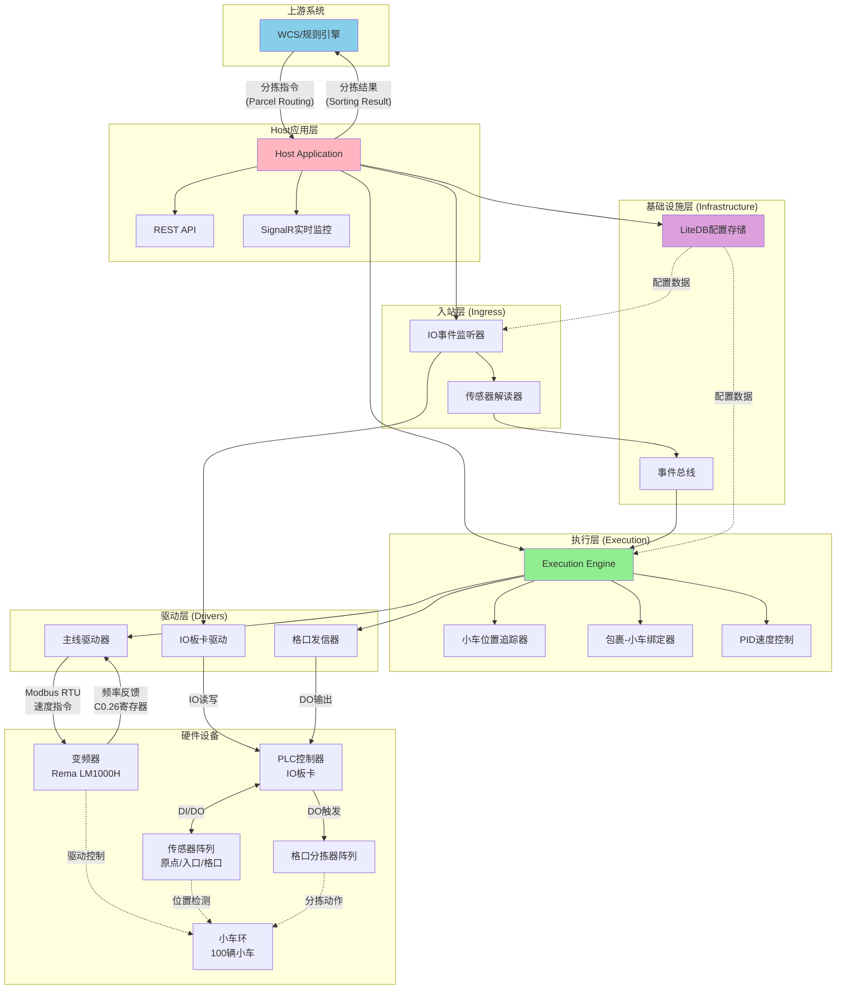
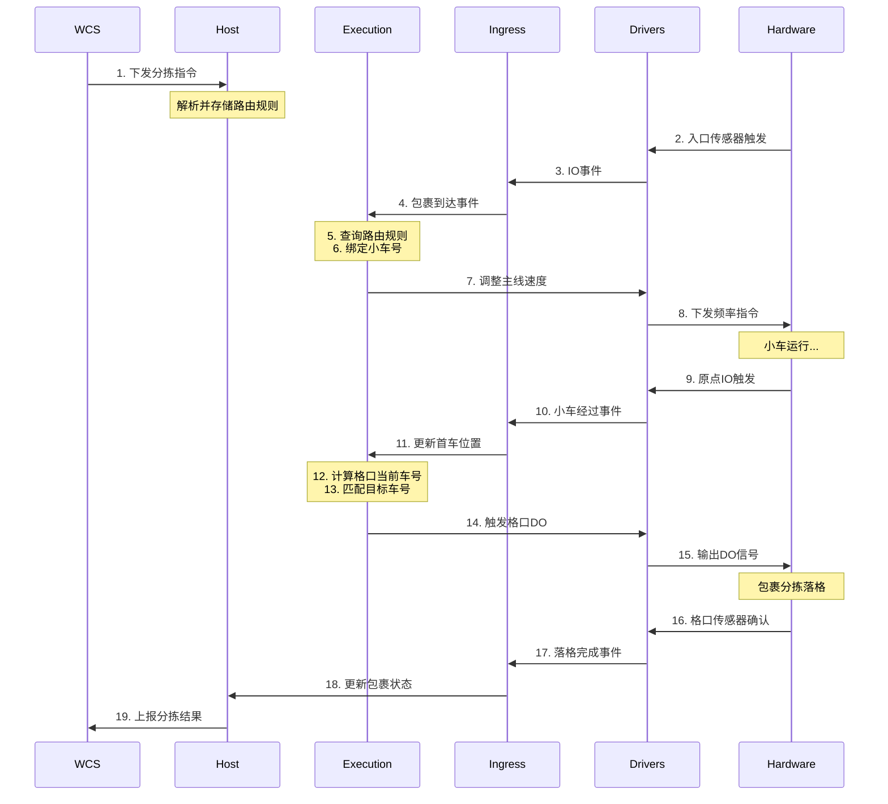

# 系统拓扑图 (System Topology)

## 概述

本文档描述窄带分拣系统的完整拓扑结构，包括上游系统、应用层、硬件层以及各组件之间的通信关系。

---

## 整体系统拓扑

### 系统组件关系图

---

## 详细拓扑说明

### 1. 上游系统连接

#### WCS/规则引擎
- **职责**: 提供包裹分拣指令和目标格口
- **通信协议**: 
  - 使用 `Communication` 层的 TCP 客户端
  - 协议格式: JSON over TCP
- **消息类型**:
  - `ParcelRoutingRequestDto`: 请求分配格口
  - `ParcelRoutingResponseDto`: 接收分配的目标格口
  - `SortingResultReportDto`: 上报分拣完成结果

#### 重试策略
- **连接失败**: 无限重试，指数退避，最大间隔2秒
- **发送失败**: 仅记录日志，不重试
- **热更新支持**: 可通过API更新连接参数，立即生效

---

### 2. Host应用层

#### 核心职责
- 应用程序启动和生命周期管理
- 依赖注入（DI）配置
- REST API端点暴露
- SignalR实时监控Hub
- 中间件配置（日志、异常处理）

#### 关键约束
- **打薄原则**: Host层不包含业务逻辑
- **依赖抽象**: 仅依赖Core/Application层接口，不直接依赖Infrastructure具体类型
- **配置驱动**: 通过配置文件切换实现（如主线驱动: Simulation vs RemaLm1000H）

---

### 3. Execution执行层

#### 核心组件

**小车位置追踪器 (CartPositionTracker)**
- 监听原点IO事件
- 维护环形数组（100辆小车）
- 通过双IO识别首车（0号车）
- 实时更新首车位置

**包裹-小车绑定器 (PackageCartBinder)**
- 包裹上料时绑定到当前小车
- 使用格口解析器计算目标车号
- 确保包裹与小车号一致性

**PID速度控制器**
- 根据包裹密度和窗口要求调整主线速度
- 实时计算速度偏差
- 通过主线驱动器下发速度指令

**格口发信器控制器**
- 监控小车位置
- 当目标车号到达格口时触发DO
- 控制发信器窗口时间（通常100ms）

---

### 4. Ingress入站层

#### IO事件监听器
- 订阅PLC IO板卡事件
- 实时接收DI状态变化
- 按通道号分发事件

#### 传感器解读器
- **入口传感器**: 检测包裹到达，触发包裹创建
- **原点传感器**: 双IO逻辑，识别首车和普通车
- **格口传感器**: 确认包裹成功落格

---

### 5. Infrastructure基础设施层

#### LiteDB配置存储
- 持久化系统配置
  - 小车环配置（总车数）
  - 格口配置（基准车号、IO通道）
  - IO映射配置
- 支持热更新
- 变更通知机制

#### 事件总线
- 解耦组件间通信
- 异步事件分发
- 支持多订阅者模式

---

### 6. Drivers驱动层

#### 主线驱动器

**仿真实现 (SimulationMainLineDrive)**
- 用于开发和测试
- 模拟速度渐变和反馈
- 无需真实硬件

**Rema LM1000H实现 (RemaLm1000HMainLineDrive)**
- 通过Modbus RTU通信
- 下发频率指令到C0.01寄存器
- 读取频率反馈从C0.26寄存器
- 内置PID控制算法

#### IO板卡驱动
- 抽象IO读写接口
- 支持多厂商板卡
- 提供DI监听和DO输出

#### 格口发信器
- 控制DO输出时序
- 支持窗口时间配置
- 记录发信事件

---

### 7. 硬件设备层

#### 变频器（Rema LM1000H）
- 控制主线电机转速
- 接收Modbus RTU指令
- 反馈实时频率

#### PLC控制器
- IO板卡，提供DI/DO
- 连接所有传感器和发信器
- 实时采集和输出

#### 传感器阵列
- **原点传感器**: 2个，双IO识别首车
- **入口传感器**: 检测包裹上料
- **格口传感器**: 确认落格成功

#### 小车环
- 100辆小车环形运行
- 0号车配有加长金属板（双IO触发）
- 其他车单IO触发

#### 格口分拣器阵列
- 每个格口配有发信器
- 接收DO触发信号
- 控制小车旋转，包裹滑落

---

## 数据流向

### 正常分拣流程数据流

---

## 配置与管理

### 可通过API动态配置的项
- 上游WCS连接参数（IP、端口）
- 小车环总数
- 格口基准车号
- IO通道映射
- PID参数
- 速度限制

### 需要重启才能生效的配置
- 主线驱动实现类型（Simulation vs RemaLm1000H）
- 串口配置（波特率、数据位）

---

## 监控与可观测性

### SignalR实时监控
- 小车位置实时更新
- 包裹状态追踪
- 格口DO触发事件
- 速度曲线图
- 异常告警推送

### 日志系统
- 分层日志（Debug/Info/Warning/Error）
- 日志节流（相同内容1秒间隔）
- 保留3天（可配置）
- 文件滚动和压缩

---

## 参考文档

- [分层架构说明](./LayeredArchitecture.md)
- [核心业务流程](./CoreBusinessFlow.md)
- [异常处理流程](./ExceptionHandlingFlow.md)
- [窄带分拣机设计](./NarrowBeltDesign.md)
- [小车编号与格口绑定](../NarrowBelt/CartNumberingAndChutes.md)

---

**版本**: v1.0  
**最后更新**: 2025-11-21  
**维护者**: ZakYip Team
