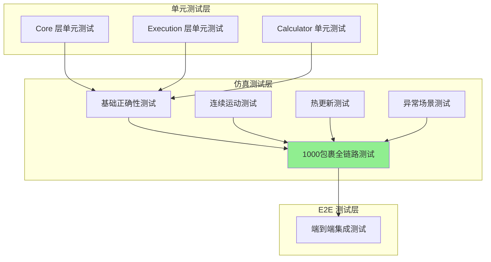
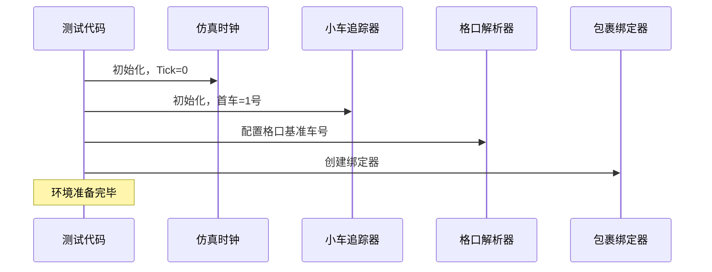
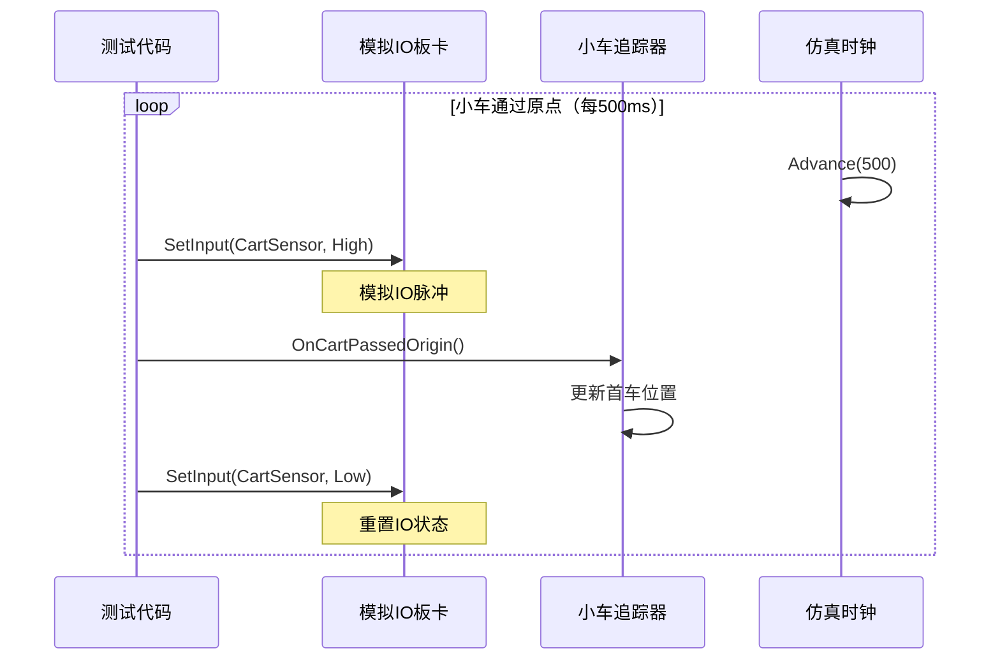
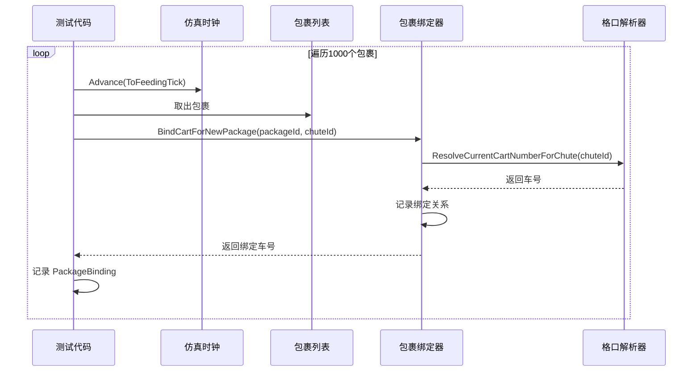
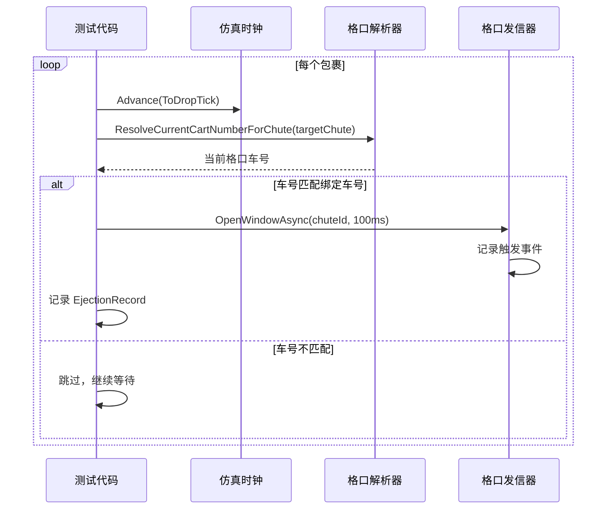

# 仿真测试说明 (Simulation Testing)

## 概述

本文档详细说明窄带分拣系统的仿真测试体系，重点介绍 1000 包裹全链路仿真测试的设计、实现和验证方法。

---

## 仿真测试架构

### 测试分层



---

## 1000 包裹全链路仿真测试

### 测试目标

验证从"API 配置电柜面板启动按钮"到"正确落格"的完整流程，确保系统在大规模包裹处理场景下的正确性和稳定性。

### 测试覆盖范围


### 测试实现位置

**文件路径**:
```
Tests/ZakYip.NarrowBeltDiverterSorter.Simulator.Tests/
  └─ Simulation/
      └─ PanelStartToChuteDropSimulation/
          ├─ PanelStartToChuteDropSimulationTests.cs  (主测试类)
          ├─ SimulatedIoBoard.cs                       (模拟IO板卡)
          ├─ SimulatedCartPositionTracker.cs          (模拟小车追踪器)
          ├─ SimulatedChuteTransmitterPort.cs         (模拟格口发信器)
          ├─ SimulatedParcel.cs                        (模拟包裹)
          └─ SimulationClock.cs                        (仿真时钟)
```

### 核心测试方法

```csharp
[Fact]
public async Task Should_CorrectlyIdentifyCarts_AndDropParcels_For1000Packages()
{
    // Arrange - 初始化仿真环境
    var clock = new SimulationClock();
    var ioBoard = new SimulatedIoBoard();
    var cartTracker = new SimulatedCartPositionTracker(TotalCartCount);
    var chuteTransmitter = new SimulatedChuteTransmitterPort(clock);
    
    // 初始化小车追踪器
    cartTracker.Initialize();
    cartTracker.SetCurrentOriginCartIndex(0); // 从1号车开始
    
    // 配置格口解析器
    var resolver = CreateCartAtChuteResolver(cartTracker);
    var binder = new PackageCartBinder(resolver, NullLogger<PackageCartBinder>.Instance);
    
    // 生成1000个包裹
    var parcels = GenerateParcels(1000);
    
    // 记录绑定和落格事件
    var packageBindings = new Dictionary<long, PackageBinding>();
    var ejectionEvents = new List<EjectionRecord>();
    
    // Act - 仿真执行（省略详细代码）
    
    // Assert - 验证结果
    Assert.Equal(1000, packageBindings.Count);
    Assert.Equal(1000, ejectionEvents.Count);
    
    // 验证每个包裹的落格格口与目标一致，车号与绑定车号一致
    foreach (var ejection in ejectionEvents)
    {
        var binding = packageBindings[ejection.PackageId];
        Assert.Equal(binding.TargetChuteId, ejection.ChuteId);
        Assert.Equal(binding.CartNumber, ejection.CartNumber);
    }
}
```

---

## 仿真组件说明

### SimulationClock（仿真时钟）

**职责**: 提供可控的时间推进机制

```csharp
public sealed class SimulationClock
{
    private int _currentTick = 0;
    
    public int CurrentTick => _currentTick;
    
    public void Advance(int ticks)
    {
        _currentTick += ticks;
    }
}
```

**用途**:
- 模拟时间流逝
- 控制包裹上料时序
- 精确计算窗口触发时间

---

### SimulatedIoBoard（模拟IO板卡）

**职责**: 模拟 DI/DO 状态和事件

```csharp
public sealed class SimulatedIoBoard
{
    private readonly ConcurrentDictionary<int, bool> _inputs = new();
    private readonly ConcurrentDictionary<int, bool> _outputs = new();
    private readonly List<OutputHistoryEntry> _outputHistory = new();
    
    public void SetInput(int channel, bool state)
    {
        _inputs[channel] = state;
        // 可选：触发 InputChanged 事件
    }
    
    public void SetOutput(int channel, bool state)
    {
        _outputs[channel] = state;
        _outputHistory.Add(new OutputHistoryEntry(
            channel, state, DateTimeOffset.Now));
    }
    
    public List<OutputHistoryEntry> GetAllOutputHistory() => _outputHistory;
}
```

**用途**:
- 模拟原点传感器触发（双IO）
- 模拟入口传感器触发
- 模拟格口发信器DO输出
- 记录IO历史用于验证

---

### SimulatedCartPositionTracker（模拟小车追踪器）

**职责**: 模拟小车环运行和位置追踪

```csharp
public sealed class SimulatedCartPositionTracker
{
    private readonly int _totalCartCount;
    private int _currentOriginCartIndex; // 0-based
    
    public SimulatedCartPositionTracker(int totalCartCount)
    {
        _totalCartCount = totalCartCount;
    }
    
    public void Initialize()
    {
        _currentOriginCartIndex = 0;
    }
    
    public void SetCurrentOriginCartIndex(int index)
    {
        _currentOriginCartIndex = index;
    }
    
    public void OnCartPassedOrigin(DateTimeOffset timestamp)
    {
        _currentOriginCartIndex = (_currentOriginCartIndex + 1) % _totalCartCount;
    }
    
    public int GetCurrentOriginCartIndex() => _currentOriginCartIndex;
}
```

**用途**:
- 模拟小车经过原点
- 维护当前首车位置
- 提供位置查询接口

---

### SimulatedChuteTransmitterPort（模拟格口发信器）

**职责**: 模拟格口DO触发和事件记录

```csharp
public sealed class SimulatedChuteTransmitterPort : IChuteTransmitterPort
{
    private readonly SimulationClock _clock;
    private readonly List<EjectionEvent> _events = new();
    
    public async Task OpenWindowAsync(
        ChuteId chuteId, 
        TimeSpan duration, 
        CancellationToken ct = default)
    {
        _events.Add(new EjectionEvent(
            chuteId, 
            _clock.CurrentTick, 
            duration));
        
        // 模拟异步等待（实际仿真可以跳过）
        await Task.CompletedTask;
    }
    
    public List<EjectionEvent> GetEjectionEvents() => _events;
}
```

**用途**:
- 记录所有格口触发事件
- 验证触发时序和频率
- 检查DO输出正确性

---

### SimulatedParcel（模拟包裹）

**职责**: 表示测试用包裹数据

```csharp
public sealed class SimulatedParcel
{
    public required long PackageId { get; init; }
    public required int TargetChuteId { get; init; }
    public required int FeedingTick { get; init; } // 上料时刻（仿真时钟tick）
}
```

---

## 测试场景详细流程

### 阶段1: 环境初始化



### 阶段2: 小车识别仿真



### 阶段3: 包裹上料与绑定



### 阶段4: 窗口匹配与落格



---

## 测试验证断言

### 关键验证点

#### 1. 包裹绑定完整性
```csharp
// 验证1：所有包裹都绑定了车号
Assert.Equal(1000, packageBindings.Count);

// 验证2：车号范围合法
foreach (var binding in packageBindings.Values)
{
    Assert.InRange(binding.CartNumber, 1, TotalCartCount);
}
```

#### 2. 落格事件完整性
```csharp
// 验证3：落格事件数量等于包裹数量
Assert.Equal(1000, ejectionEvents.Count);

// 验证4：无重复包裹ID
var uniquePackageIds = ejectionEvents.Select(e => e.PackageId).Distinct().Count();
Assert.Equal(1000, uniquePackageIds);
```

#### 3. 格口与车号一致性
```csharp
// 验证5：每个包裹的落格格口与目标格口一致
foreach (var ejection in ejectionEvents)
{
    var binding = packageBindings[ejection.PackageId];
    Assert.Equal(binding.TargetChuteId, ejection.ChuteId);
}

// 验证6：落格时的车号与绑定车号一致
foreach (var ejection in ejectionEvents)
{
    var binding = packageBindings[ejection.PackageId];
    Assert.Equal(binding.CartNumber, ejection.CartNumber);
}
```

#### 4. 格口覆盖完整性
```csharp
// 验证7：所有配置的格口都有包裹落格
var chutesUsed = ejectionEvents.Select(e => e.ChuteId).Distinct().ToList();
Assert.Contains(Chute1Id, chutesUsed);
Assert.Contains(Chute2Id, chutesUsed);
Assert.Contains(Chute3Id, chutesUsed);
```

#### 5. 发信器事件记录
```csharp
// 验证8：发信器记录了所有触发事件
var transmitterEvents = chuteTransmitter.GetEjectionEvents();
Assert.Equal(1000, transmitterEvents.Count);
```

---

## 运行仿真测试

### 命令行运行

```bash
# 运行所有仿真测试
cd /path/to/ZakYip.NarrowBeltDiverterSorter
dotnet test Tests/ZakYip.NarrowBeltDiverterSorter.Simulator.Tests

# 仅运行1000包裹测试
dotnet test Tests/ZakYip.NarrowBeltDiverterSorter.Simulator.Tests \
  --filter "FullyQualifiedName~Should_CorrectlyIdentifyCarts_AndDropParcels_For1000Packages"

# 使用类别过滤
dotnet test --filter "TestCategory=Simulation"
```

### Visual Studio 运行

1. 打开 Test Explorer
2. 定位到 `PanelStartToChuteDropSimulationTests`
3. 右键 → Run Tests
4. 查看测试结果和断言输出

### CI/CD 集成

仿真测试已集成到 CI pipeline，每次提交自动运行：

```yaml
# .github/workflows/ci.yml
- name: Run Tests
  run: dotnet test --verbosity normal
```

---

## 测试数据生成

### 包裹生成策略

```csharp
private List<SimulatedParcel> GenerateParcels(int count)
{
    var parcels = new List<SimulatedParcel>();
    var random = new Random(42); // 固定种子确保可重复性
    var validChutes = new[] { Chute1Id, Chute2Id, Chute3Id };
    
    for (int i = 1; i <= count; i++)
    {
        parcels.Add(new SimulatedParcel
        {
            PackageId = i,
            TargetChuteId = validChutes[random.Next(validChutes.Length)],
            FeedingTick = i * 50 // 每50ms上一个包裹
        });
    }
    
    return parcels;
}
```

**特点**:
- 固定随机种子（42）确保结果可重复
- 均匀分布到3个格口
- 上料间隔50ms（可调整）

---

## 性能基准

### 测试执行时间

| 测试规模 | 执行时间 | 备注 |
|----------|----------|------|
| 100 包裹 | ~50ms | 快速回归测试 |
| 1000 包裹 | ~200ms | 标准全链路测试 |
| 10000 包裹 | ~2s | 压力测试（可选） |

### 资源消耗

- **内存**: < 50MB
- **CPU**: < 10%（单核）
- **磁盘**: 0（纯内存测试）

---

## 扩展测试场景

### 其他仿真测试套件

#### 基础正确性测试
**位置**: `Simulation/CartAtChuteBinding/BasicCorrectnessSimulationTests.cs`
- 各种首车位置下的车号计算
- 包裹绑定一致性
- 边界条件验证

#### 连续运动测试
**位置**: `Simulation/CartAtChuteBinding/ContinuousMovementSimulationTests.cs`
- 小车环完整循环
- 环绕边界处理
- 多格口独立计算

#### 热更新测试
**位置**: `Simulation/CartAtChuteBinding/HotUpdateSimulationTests.cs`
- 配置热更新
- 新旧配置不混淆
- 绑定关系正确切换

#### 异常场景测试
**位置**: `Simulation/CartAtChuteBinding/ErrorScenarioSimulationTests.cs`
- 配置未找到
- 车号越界
- 追踪器未初始化
- 中文异常消息验证

---

## 调试技巧

### 启用详细日志

```csharp
// 在测试中注入真实 Logger
var loggerFactory = LoggerFactory.Create(builder =>
{
    builder.AddConsole();
    builder.SetMinimumLevel(LogLevel.Debug);
});

var logger = loggerFactory.CreateLogger<PackageCartBinder>();
var binder = new PackageCartBinder(resolver, logger);
```

### 断点调试

- 在绑定逻辑设置断点
- 检查绑定车号是否正确
- 验证格口解析器输出

### 可视化输出

```csharp
foreach (var ejection in ejectionEvents)
{
    Console.WriteLine(
        $"PackageId={ejection.PackageId}, " +
        $"ChuteId={ejection.ChuteId}, " +
        $"CartNumber={ejection.CartNumber}, " +
        $"Tick={ejection.Tick}");
}
```

---

## 常见问题排查

### 问题1: 落格数量少于包裹数量

**可能原因**:
- 窗口匹配逻辑错误
- 车号计算公式错误
- 小车追踪器状态异常

**排查方法**:
```csharp
// 在窗口匹配处添加日志
if (cartAtTargetChute == boundCartNumber)
{
    Console.WriteLine($"匹配! Package={packageId}, Cart={cartAtTargetChute}");
}
else
{
    Console.WriteLine($"不匹配: Package={packageId}, Expected={boundCartNumber}, Actual={cartAtTargetChute}");
}
```

### 问题2: 车号与格口对应错误

**可能原因**:
- 格口基准车号配置错误
- 环形数组计算公式错误
- 首车位置更新不及时

**排查方法**:
```csharp
// 打印格口配置
Console.WriteLine($"Chute {chuteId} BaseCart: {chuteConfig.CartNumberWhenHeadAtOrigin}");

// 打印当前首车位置
Console.WriteLine($"Current HeadCartNumber: {tracker.GetCurrentOriginCartIndex() + 1}");
```

---

## 参考文档

- [核心业务流程](../Architecture/CoreBusinessFlow.md)
- [小车编号与格口绑定](../NarrowBelt/CartNumberingAndChutes.md)
- [异常处理流程](../Architecture/ExceptionHandlingFlow.md)
- [系统拓扑图](../Architecture/SystemTopology.md)

---

**版本**: v1.0  
**最后更新**: 2025-11-21  
**维护者**: ZakYip Team
